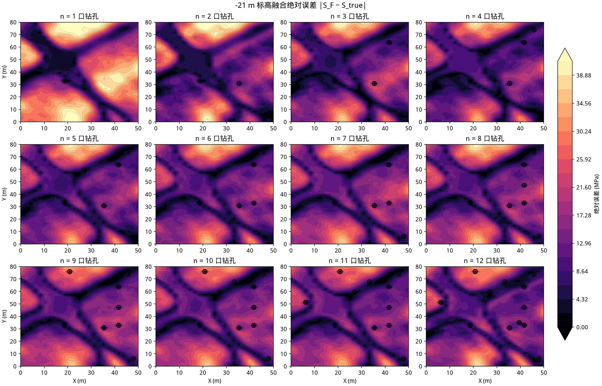

# MWD–地震物理约束岩石强度融合

Physics-constrained fusion of MWD and seismic rock strength

**摘要。** 露天矿爆破块段需要连续的三维单轴抗压强度（UCS）场，而现场只有两类不对等观测：沿钻孔的力学硬数据，以及覆盖全块、只与强度间接相关的叠后波阻抗。本文把随钻测量（MWD）经 Teale 比能与物理引导高斯过程压成孔点 UCS，再以深度为趋势做三维回归克里金，得到主变量 $S_M$；把叠后地震经 Tikhonov 反演得到波阻抗，在共定位孔点上标定 $\mathrm{UCS}=g(\mathrm{AI})$，得到全区次变量 $S_Z$；两口井及以上用外漂移克里金（KED）把深度与 $S_Z$ 当作漂移、孔点 UCS 当作硬数据，残差变程取孔距；单口井改走 Doyen 共定位更新，以免一口井的过拟合铺满全块。孔体素一律钉回点估计。定量结论来自固定种子合成矿山：块段 $50\times 80\times 40~\mathrm{m}$，网格 $25\times 40\times 40$，14 口梅花孔布置在中心 $20\times 50~\mathrm{m}$ 工作面内部，`seed = 42`。该工作面上融合 $R^2=0.848$、RMSE $=5.17~\mathrm{MPa}$，优于钻孔插值（$0.602$ / $8.37$）、波阻抗插值（$0.636$ / $8.02$）与简单平均（$0.711$ / $7.14$）。孔轨迹上融合与钻孔插值同为 $2.41~\mathrm{MPa}$。

**关键词：** 随钻测量；波阻抗反演；外漂移克里金；球状变差函数；物理引导高斯过程；岩石单轴抗压强度

---

## 目录

1. [引言](#1-引言)
2. [相关工作](#2-相关工作)
3. [符号与合成矿山](#3-符号与合成矿山)
4. [方法](#4-方法)
5. [结果](#5-结果)
6. [讨论与局限](#6-讨论与局限)
7. [参考文献](#参考文献)

---

## 1. 引言

露天矿爆破设计与岩体分区需要连续的三维强度场，现场能直接测到的却只有两类不对等观测（表 1）。MWD 与岩心给出钻速、转速、扭矩、轴压以及孔内 UCS：空间上是横向极稀的一维线，但与目标量接近。三维地震给出叠后振幅：空间上全区连续，必须经过波阻抗 $\mathrm{AI}=\rho V_p$ 才与强度间接相关。

**表 1 | 两类观测。** UCS 为目标量（单轴抗压强度）。

| 源 | 测到什么 | 空间覆盖 | 与 UCS 的关系 |
| --- | --- | --- | --- |
| MWD + 岩心 | 钻速 $V$、转速 $N$、扭矩 $M$、轴压 $F$，以及孔内 UCS | 沿钻孔的一维线，横向极稀 | 力学响应，接近目标量 |
| 三维地震 | 叠后振幅 | 全区连续 | 经波阻抗 $\mathrm{AI}=\rho V_p$ 间接相关 |

仅用钻孔把 UCS 插到三维，即使缩到 $20\times 50~\mathrm{m}$ 工作面、14 口孔按梅花布置在内部，相邻孔距仍约一个工作面尺度。克里金在孔旁忠实、孔间变光滑：硬矿体轮廓发糊，断裂和蚀变晕对不上。这不是选错了插值核，而是观测几何不够 [1]–[4]。地震波阻抗能看见这些结构，但它不是强度：特征阻抗与 UCS 相关，却随岩性变化，不能当成通用标尺 [18], [19]。

因此方案不是“换一个更尖的核”，也不是把已经插好的两张强度图再做平均，而是储层建模里井加地震的标准做法 [5], [6]。三维场拆成三条可对照的插值路径（表 2）：钻孔插值 $S_M$、波阻抗插值 $S_Z$、融合插值 $S_F$。两口井及以上走 KED，单口井走 Doyen；残差变程取孔距，硬矿体峰值不被共定位相关系数 $\rho$ 打折。井是硬数据，地震是约束。

**表 2 | 三条插值路径。** 残差定义为预测减去真值，三列共用红蓝标。

| 名称 | 含义 |
| --- | --- |
| 强度真值 | 合成矿山的 UCS，只用于验证 |
| 钻孔插值 $S_M$ | 孔点 UCS 的三维回归克里金 |
| 波阻抗插值 $S_Z$ | 全区 $\mathrm{AI}\to\mathrm{UCS}$ 标定 |
| 融合插值 $S_F$ | 外漂移克里金（单井走 Doyen） |
| 钻孔 / 波阻抗 / 融合残差 | 预测减去真值 |

下文第 2 节交代文献分工，第 3 节给出符号与合成几何，第 4 节按“克里金预备 → 钻孔 → 地震 → 融合”写出方程，第 5 节用同一套图件给出证据。

---

## 2. 相关工作

克里金把空间估计写成变差函数约束的线性无偏组合，而不是任意距离衰减 [1], [2]。矿业与石油实践中，井稀而准、地震密而不准是同一类数据配置。Xu、Tran、Srivastava 与 Journel 比较了外漂移克里金（井为硬数据，地震为漂移）与共定位协克里金 [5]。Doyen、den Boer 与 Pillet 把共定位协克里金写成对井克里金的贝叶斯更新，并用于 Ekofisk 孔隙度填图 [6]。土壤学把线性协变量加残差克里金称作回归克里金，并证明它与 KED 在线性漂移下等价 [7], [8]。多元表述见 Wackernagel [9]、Chilès 与 Delfiner [10]、Deutsch 与 Journel [14]、Goovaerts [15]。

Doyen 更新在远处按 $\rho$ 把次变量异常往均值缩。本基准 $\rho\approx 0.76$，硬矿体在 $S_Z$ 上的峰值会被压到约四分之三。两口井及以上因此采用 KED：漂移系数乘在整张 $S_Z$ 上，残差只在孔距尺度上插值。单口井仍走 Doyen，避免 GP 标定把一口井拟合到 $\rho_{S_Z}\approx 1$ 后铺满工作面。

随钻方面，Teale 把破碎功收成比能，并指出它与强度单调相关 [11]。露天矿爆破孔的 Monitor-While-Drilling 用同一类比能指标识别岩性和煤层界面 [16]；也有工作直接用钻速、轴压、扭矩、转速训练黑盒模型预测 UCS [17]。这里不走端到端网络：比能作物理均值，高斯过程只拟合残差 [23]，样本外退回 Teale 基线。

叠后波阻抗反演是带限反问题。Lindseth 指出反射系数积分只能给出缺低频的阻抗 [20]；Oldenburg、Scheuer 与 Levy 把从反射地震恢复波阻抗写成反问题 [21]；Russell 与 Hampson 把模型基反演写成低频背景加子波正演、迭代拟合叠后道 [22]。稳定化用 Tikhonov 正则 [12] 与平滑低频背景；零相位 Ricker 子波提供褶积核 [13]。

波阻抗与 UCS 有经验相关，但不是恒等。特征阻抗与完整岩石 UCS 等力学量的回归 $R^2$ 约在 $0.80$–$0.97$ [18]；沉积岩里 UCS–速度公式随岩性散得很开，必须就地标定 [19]。所以 $g(\mathrm{AI})$ 只在共定位孔点上学习，而不是套用一张通用表。

公开数据中不存在共定位的 MWD、UCS、三维地震与 AI。定量比较因此放在合成矿山上，而不是训练无法验证的端到端网络。

---

## 3. 符号与合成矿山

表 3 列出后文反复出现的符号。单位用 SI；强度用兆帕，波阻抗用 $\mathrm{kg}/(\mathrm{m}^{2}\mathrm{s})$。向量粗体，估计量加帽。

**表 3 | 主要符号。**

| 符号 | 含义 | 单位 / 取值 |
| --- | --- | --- |
| $\mathbf{u}=(x,y,z)$ | 空间位置 | $\mathrm{m}$；标高向下为负 |
| $Z(\mathbf{u})$，$S(\mathbf{u})$ | 区域化变量；UCS 场 | $\mathrm{MPa}$ |
| $\gamma(h)$，$C(h)$ | 变差函数；协方差 | $C(h)=C(0)-\gamma(h)$ |
| $C_0$，$C$，$a$ | 块金；偏基台；变程 | 残差变程 $a=1.15\times$ 中位孔距 |
| $\boldsymbol{\lambda}$，$\mu$ | 克里金权；拉格朗日乘子 | $\sum_i\lambda_i=1$ |
| $S_M$，$S_Z$，$S_F$ | 钻孔 / 波阻抗 / 融合插值 | $\mathrm{MPa}$ |
| $\mathrm{AI}=\rho V_p$ | 纵波波阻抗 | $\mathrm{kg}/(\mathrm{m}^{2}\mathrm{s})$ |
| $\mathrm{SE}'$ | Teale 比能 | 与轴压同量纲 |
| $m(\mathbf{u})$ | 漂移（趋势） | 线性：深度与 $S_Z$ |
| $r(\mathbf{u})$ | 残差 $Z-m$ | 对 $r$ 做普通克里金 |
| $\rho$ | $\mathrm{corr}(\mathrm{UCS},\mathrm{AI})$ | 本基准约 $0.76$ |
| $n$ | 钻孔数 | 默认 $14$ |

全块 $X\in[0,50]~\mathrm{m}$，$Y\in[0,80]~\mathrm{m}$，标高 $0\to -40~\mathrm{m}$（约十个台阶），网格 $25\times 40\times 40$。默认工作面为中心 $20\times 50~\mathrm{m}$（$X\in[15,35]$，$Y\in[15,65]$）。可视化只显示该窗口，并可在全块上平移；这是显示截取，三维场仍一次算完。定量结论若无另行说明，均来自该几何、`seed = 42`、14 口孔，评价指标限制在工作面体积上。

公开数据天然是拆开的。合成矿山因此在同一坐标系构造真值。潜变量“岩体胜任度” $c(x,y,z)$ 同时驱动 UCS 与 AI，二者相关但不是恒等：UCS 另加风化 / 蚀变力学残差（波阻抗看不见），AI 另加独立声学纹理。若不做这个拆分，$\mathrm{corr}(\mathrm{AI},\mathrm{UCS})$ 会冲到 $0.98$，平面图上钻孔分支看起来像多余。仿射标定：

```math
\mathrm{UCS}=20+150\,c_{\mathrm{UCS}} \quad(\mathrm{MPa}),
\qquad
\mathrm{AI}=\bigl(4+7\,c_{\mathrm{AI}}\bigr)\times 10^{6}
\quad\bigl(\mathrm{kg}/(\mathrm{m}^{2}\mathrm{s})\bigr).
\qquad (1)
```

其中 $c_{\mathrm{UCS}}\approx 0.52 c - 0.50 c_{\mathrm{mech}}$，$c_{\mathrm{AI}}\approx 0.40 c + 0.60 \tau$，$\tau$ 为独立平滑随机场。本基准 $\mathrm{corr}(\mathrm{AI},\mathrm{UCS})\approx 0.76$。MWD 由 UCS 经单调物理关系加噪声生成（钻速随强度指数衰减，轴压 / 扭矩随强度上升），因此孔点反演可学但有噪声。

14 口孔按爆破常用的梅花 / 三角网格铺在工作面**内部**：邻行错半个孔距，中列补两个孔，格子相对边界内缩约三分之一孔距，不贴边（图 1）。$1\to N$ 实验的嵌套前缀按最远点排序，稀疏子集同样铺开。孔内每个深度节点都有样本。


**图 1 | 梅花布孔。** 合成块段平面 $50\times 80~\mathrm{m}$。14 口孔按 $5{+}4{+}5$ 三角网格落在中心 $20\times 50~\mathrm{m}$ 工作面内部。色点为孔口平面位置。`seed = 42`。


**图 2 | 工作面窗口。** 红框为默认可平移的 $20\times 50~\mathrm{m}$ 截取，叠在 UCS 真值水平切片上。全块保持 $50\times 80~\mathrm{m}$ 以便把工作面移到别处；克里金仍在全块上一次算完。

---

## 4. 方法

两路独立反演，只在共定位孔点上交换信息：MWD 提供训练样本，孔点同时提供 $\mathrm{AI}$–UCS 标定样本。

```
真值世界 (UCS_true, AI_true, 共定位 MWD)
        |                              |
   MWD 分支                       地震分支
   V, N, M, F → 比能 → PG-GPR        AI → 反射系数 → 合成地震
   → 孔点 UCS 与 σ                   → Tikhonov 反演 → AI_inv
   → 以深度为趋势的回归克里金         → 孔点 GP 标定 UCS = f(AI)
   → S_M                             → S_Z
        └─ 外漂移克里金（漂移 = 深度 + S_Z；单井 Doyen）─┘
                          |
                         S_F  与 UCS_true 对比
```

### 4.1 变差函数与普通克里金

设区域化变量 $Z(\mathbf{u})$ 在研究域 $D\subset\mathbb{R}^3$ 上二阶平稳，或至少本征平稳 [2], [3]。变差函数

```math
\gamma(\mathbf{h})
=\frac{1}{2}\,\mathrm{E}\bigl[Z(\mathbf{u}+\mathbf{h})-Z(\mathbf{u})\bigr]^2
\qquad (2)
```

度量相距 $\mathbf{h}$ 的点对半方差。各向同性时 $\gamma(\mathbf{h})=\gamma(\|\mathbf{h}\|)$。实现采用矿业中常用的球状模型 [3], [14]：

```math
\gamma(h)=
\begin{cases}
0, & h=0,\\
C_0 + C\bigl(\dfrac{3h}{2a}-\dfrac{h^3}{2a^3}\bigr), & 0<h\le a,\\
C_0+C, & h>a.
\end{cases}
\qquad (3)
```

$C_0$ 为块金，$C_0+C$ 为基台，$a$ 为变程。残差克里金把变程钉在 $1.15\times$ 中位孔距（约 $16.5~\mathrm{m}$），块金取基台的 $5\%$（图 3）。超过变程后残差估计回到零，融合场回到漂移——这是“孔旁有力学残差、孔间交给波阻抗”的几何来源。小块上若自由拟合，变程会被拉到域对角线，把地震看不见的力学残差抹平。


**图 3 | 球状变差函数。** 横轴为滞后距离 $h$（米），纵轴为半方差 $\gamma(h)$。变程 $a$ 控制孔旁力学残差能走多远；超过变程后权回到漂移。块金取基台的 $5\%$。曲线对应本基准残差克里金，而非经验变差图的自动拟合。

垂向采样远密于平面。把 $z$ 轴按 3 倍拉伸后再算欧氏距离，等价于几何各向异性

```math
h
=\sqrt{
\Bigl(\frac{h_x}{a_x}\Bigr)^2
+\Bigl(\frac{h_y}{a_y}\Bigr)^2
+\Bigl(\frac{h_z}{a_z}\Bigr)^2
},\qquad a_z = 3\,a_x.
\qquad (4)
```

普通克里金估计未知点 $\mathbf{u}_0$ 的无偏线性组合 [3], [4]

```math
\hat{Z}(\mathbf{u}_0)
=\sum_{i=1}^{n}\lambda_i Z(\mathbf{u}_i),
\qquad
\sum_{i=1}^{n}\lambda_i=1.
\qquad (5)
```

权由变差函数方程组给出（与协方差形式等价，本征平稳下更自然）[14]：

```math
\begin{pmatrix}
\Gamma & \mathbf{1}\\
\mathbf{1}^{\top} & 0
\end{pmatrix}
\begin{pmatrix}
\boldsymbol{\lambda}\\ \mu
\end{pmatrix}
=
\begin{pmatrix}
\boldsymbol{\gamma}_0\\ 1
\end{pmatrix},
\qquad
\Gamma_{ij}=\gamma(\mathbf{u}_i-\mathbf{u}_j),
\quad
(\boldsymbol{\gamma}_0)_i=\gamma(\mathbf{u}_i-\mathbf{u}_0).
\qquad (6)
```

拉格朗日乘子 $\mu$ 强制无偏。克里金方差

```math
\sigma_{\mathrm{OK}}^{2}(\mathbf{u}_0)
=\boldsymbol{\lambda}^{\top}\boldsymbol{\gamma}_0+\mu
\qquad (7)
```

在样品处为块金量级、在样品间随变程增大——这正是“钻孔插值在孔旁准、孔间光滑”的来源。单孔时三维滞后无法识别，则退化为基台 $=\mathrm{Var}\lbrace Z_i\rbrace$、变程 $=$ 域对角线之半：远离钻孔的估计回到样本均值，这是稀疏井的正确极限。

当均值不是常数而是已知协变量的线性函数时，普通克里金换成回归克里金或外漂移克里金 [8], [15]。二者在线性漂移下等价：先在样品上拟合

```math
m(\mathbf{u})
=\alpha_0+\sum_{p=1}^{P}\alpha_p\,f_p(\mathbf{u}),
\qquad (8)
```

对残差 $r_i=Z(\mathbf{u}_i)-m(\mathbf{u}_i)$ 做普通克里金，再把漂移加回

```math
\hat{Z}_{\mathrm{RK}}(\mathbf{u})
=m(\mathbf{u})+\hat{r}_{\mathrm{OK}}(\mathbf{u}).
\qquad (9)
```

KED 把 (8) 写进克里金方程组的权约束，数值上与 (9) 一致。

### 4.2 钻孔插值

原始通道为钻速 $V$、转速 $N$、扭矩 $M$、轴压 $F$。Teale 比能把破碎功收成与强度单调的物理量 [11]；露天矿爆破孔 MWD 用同一类指标刻画所钻介质 [16]：

```math
\mathrm{SE}'
=F+\frac{2\pi NM}{V}.
\qquad (10)
```

（分母加 $10^{-9}$ 防止零钻速。）再拼无量纲比，得到

```math
\mathbf{x}=\bigl(V,\,N,\,M,\,F,\,\mathrm{SE}',\,M/F,\,V/N,\,V/F\bigr).
\qquad (11)
```

直接用这些通道训练黑盒模型预测 UCS 是可行的 [17]，但样本外没有物理回退。物理引导高斯过程把比能线性趋势当作均值函数，GP 只拟合残差 [23]：

```math
\mathrm{UCS}(\mathbf{x})
=\underbrace{\beta_0+\beta_1\,\mathrm{SE}'(\mathbf{x})}_{m(\mathbf{x})}
+ f(\mathbf{x})+\varepsilon,
\qquad (12)
```

其中 $f\sim\mathcal{GP}(0,k)$，

```math
k(\mathbf{x},\mathbf{x}')
= \sigma_f^{2} \exp\Bigl(-\frac{\|\mathbf{x}-\mathbf{x}'\|^{2}}{2\ell^{2}}\Bigr)
+ \sigma_n^{2}\,\delta_{\mathbf{x}\mathbf{x}'}.
\qquad (13)
```

先对 $\mathrm{SE}'$ 做线性回归得 $\hat{\beta}$，再对残差拟合 GP。预测

```math
\hat{\mu}_{\mathrm{hole}}(\mathbf{x})=m(\mathbf{x})+\mathbb{E}[f\mid \mathcal{D}](\mathbf{x}),
\qquad
\hat{\sigma}_{\mathrm{hole}}(\mathbf{x})=\sqrt{\mathrm{Var}[f\mid \mathcal{D}](\mathbf{x})}.
\qquad (14)
```

样本稀疏时退回比能基线。这还不是空间插值，只是把四通道压成带方差的孔点 UCS。

岩石强度随深度有缓慢趋势。钻孔插值取协变量 $f_1=z$，样品值为 $\hat{\mu}_{\mathrm{hole}}$：

```math
S_M(\mathbf{u})
=\alpha_0+\alpha_1 z
+\hat{r}_{\mathrm{OK}}(\mathbf{u}).
\qquad (15)
```

孔体素写回点估计，避免块金把硬数据涂脏。克里金方差再加上孔点预测噪声的均值，避免把孔点 UCS 当成无误差真值。克里金是最优线性估计：不准，是因为横向样品不够。一口井时 $S_M$ 几乎是平面常数；孔变密后能勾出轮廓，孔间仍然过平滑。

### 4.3 波阻抗插值

声阻抗 $Z=\rho V_p$。层界面法向反射系数

```math
R_i=\frac{Z_{i+1}-Z_i}{Z_{i+1}+Z_i},
\qquad
Z_{i+1}=Z_i\frac{1+R_i}{1-R_i}.
\qquad (16)
```

相对扰动较小时 $R_i\approx \tfrac{1}{2}\Delta\ln Z_i$，反演因此在 $m=\ln Z$ 域进行。零相位 Ricker 子波 [13]

```math
w(t)=\bigl(1-2(\pi f_0 t)^{2}\bigr)\,e^{-(\pi f_0 t)^{2}}.
\qquad (17)
```

叠后道 $d=Wr$，其中 $r\approx\tfrac{1}{2}Dm$，$W$ 为褶积矩阵，$D$ 为一阶差分。复合正演算子 $G=W(\tfrac{1}{2}D)$ 把对数阻抗映射到地震道。合成记录用精确 $R_i$ 再与 $W$ 褶积，比线性化 $G$ 多保留一点非线性。

地震缺低频，绝对阻抗必须另补趋势 [20], [21]。稳定化靠平滑低频背景 $m_0=\ln Z_{\mathrm{bg}}$ 与二阶差分光滑项，与模型基叠后反演一致 [22]。单道问题 [12]

```math
\min_m \;
\|Gm-d\|_{2}^{2}
+\lambda\,\|L(m-m_0)\|_{2}^{2}
+\varepsilon\,\|m-m_0\|_{2}^{2}
\qquad (18)
```

是严格凸二次型，法方程

```math
\bigl(G^{\top} G+\lambda L^{\top} L+\varepsilon I\bigr)(m-m_0)
= G^{\top}\bigl(d-G m_0\bigr),
\qquad (19)
```

闭式解 $m=m_0+(\cdots)^{-1}G^{\top}(d-Gm_0)$，$Z=\exp(m)$。默认 $\lambda=5$，$\varepsilon=10^{-3}$，子波 31 点、$30~\mathrm{Hz}$，观测噪声为记录标准差的 $5\%$。本基准反演阻抗相对真值 $R^2=0.844$。低频背景在现场来自井曲线沿层位插值；合成实验用真值的重平滑代替，模拟“有趋势、没有高频”。

阻抗不是强度 [18], [19]。只在同时有 AI 与 UCS 的孔点上学习

```math
\mathrm{UCS}=g(\mathrm{AI})+\eta,
\qquad
g\sim\mathcal{GP}(0,k_{\mathrm{RBF}}+\text{White}),
\qquad (20)
```

再作用到整张 $\mathrm{AI}_{\mathrm{inv}}$，得到 $S_Z(\mathbf{u})=\hat g(\mathrm{AI}_{\mathrm{inv}}(\mathbf{u}))$。空间结构来自地震，力学标尺来自井。标定样本随孔数增加而变多，所以 $S_Z$ 会随 $n$ 轻微变好——不是阻抗体变了（钻孔数量实验里阻抗体固定），而是 $g$ 更稳。一口井沿深度已有数十个 $(\mathrm{AI},\mathrm{UCS})$ 对，$n=1$ 时一维标定就已经可用。

### 4.4 融合插值

主变量为孔点 UCS，漂移为深度与波阻抗强度 [5], [8]：

```math
m_{\mathrm{KED}}(\mathbf{u})
=\alpha_0+\alpha_1 z+\alpha_2 S_Z(\mathbf{u}).
\qquad (21)
```

$\boldsymbol{\alpha}$ 由孔点最小二乘估计。残差 $r_i=\hat{\mu}_{\mathrm{hole}}(\mathbf{u}_i)-m_{\mathrm{KED}}(\mathbf{u}_i)$ 做三维普通克里金，球状变程 $a=1.15\times$ 中位孔距（下限 $8~\mathrm{m}$），垂向各向异性系数 3。于是

```math
S_F(\mathbf{u})
=m_{\mathrm{KED}}(\mathbf{u})+\hat{r}_{\mathrm{OK}}(\mathbf{u}).
\qquad (22)
```

三点直接来自方程。第一，孔上 $\hat r=0$ 且体素写回，硬数据不被冲掉。第二，孔旁一个变程内，$\hat r$ 带上蚀变 / 风化等 AI 看不见的力学残差。第三，离孔后 $\hat r\to 0$，$S_F\to m_{\mathrm{KED}}$，结构与峰值来自 $S_Z$，不会被 $\rho$ 打到约 $3/4$。本基准漂移大约是 $0.84 S_Z-0.30 z$。

一口井时 GP 会把该孔拟合到 $\rho_{S_Z}\approx 1$，KED 会把过拟合铺满全块。此时改用 Doyen 标准化更新 [6]

```math
\lambda
=\frac{\rho\,\sigma_k^{\prime 2}}{\rho^{2}\sigma_k^{\prime 2}+1-\rho^{2}},
\qquad
y_{\mathrm{cc}}'
=y_k'+\lambda\bigl(y_s'-\rho\,y_k'\bigr),
\qquad (23)
```

其中 $y_k'$ 为钻孔克里金标准化值，$y_s'$ 为次变量标准化值，$\rho=\mathrm{corr}(\mathrm{UCS},\mathrm{AI})$。$\rho$ 限制更新幅度。孔上 $\sigma_M\to 0$ 仍钉住钻孔。

把已经插好的 $S_M$ 与 $S_Z$ 当成独立观测做逆方差混合，假设不成立：两路共用同一批标定井。对照基线取 $S_w=\tfrac12 S_M+\tfrac12 S_Z$。融合不是两张图的加权，而是一次以地震为漂移、以井为硬数据的克里金。

体积指标定义在工作面全体素上，孔上指标只统计孔轨迹：

```math
\mathrm{RMSE}=\sqrt{\frac{1}{N}\sum_i(t_i-p_i)^{2}},
\qquad
\mathrm{MAE}=\frac{1}{N}\sum_i|t_i-p_i|,
\qquad
R^{2}=1-\frac{\sum_i(t_i-p_i)^{2}}{\sum_i(t_i-\bar t)^{2}}.
\qquad (24)
```

---

## 5. 结果

除另行说明外，切片标高 $-20~\mathrm{m}$，窗口为默认 $20\times 50~\mathrm{m}$ 工作面，$n=14$，`seed = 42`。UCS 色标在对比图中共用。

### 5.1 三条路径与残差

图 4–6 是同一窗口、同一 UCS 色标下的钻孔插值、波阻抗插值与融合插值。梅花格子在 $S_M$ 上清晰，硬矿体峰值被变程光滑掉，这是 (3) 与 (7) 的直接后果。$S_Z$ 已经给出矿体轮廓，但蚀变晕被系统性估高。$S_F$ 的峰值来自波阻抗漂移，孔旁力学残差来自钻孔。


**图 4 | 钻孔插值 $S_M$。** 孔旁忠实于点估计，孔间光滑，硬矿体轮廓发糊。色标为 UCS（$\mathrm{MPa}$）。


**图 5 | 波阻抗插值 $S_Z$。** 与图 4 同一色标。结构来自全区 AI 经孔点 GP 标定；蚀变带没有独立力学约束。体积 RMSE $8.02~\mathrm{MPa}$，孔轨迹上 $7.23~\mathrm{MPa}$。


**图 6 | 融合插值 $S_F$。** 与图 4、图 5 同一色标。硬矿体峰值来自波阻抗漂移，孔旁残差来自钻孔。孔体素写回 $\hat\mu_{\mathrm{hole}}$。

图 7 把四者放进与前端出图同一套 $2\times 4$ 布局。上一行：强度真值、钻孔插值、波阻抗插值、融合插值。下一行：对应残差（预测减去真值），红为估高、蓝为估低，三列共用残差色标，色越浅越好。钻孔残差在硬矿体处最深；波阻抗残差轮廓对了但蚀变带偏高；融合残差最浅。


**图 7 | 融合优势对比。** 上排共用 UCS 色标（$\mathrm{MPa}$）；下排为残差。切片标高 $-20~\mathrm{m}$，工作面 $20\times 50~\mathrm{m}$，$n=14$。

图 8、图 9 把真值与反演波阻抗单独画出，便于对照量纲：前者是 UCS，后者是 $\mathrm{kg}/(\mathrm{m}^{2}\mathrm{s})$，结构对应，物理量不是同一个。


**图 8 | 强度真值。** 与图 6、图 9 同一切片窗口，色标为 UCS（$\mathrm{MPa}$）。


**图 9 | 波阻抗反演 $\mathrm{AI}_{\mathrm{inv}}$。** 色标为波阻抗。硬矿体轮廓与图 6 对应，但量纲不是强度。本基准相对真值 $\mathrm{AI}$ 的 $R^2=0.844$。

### 5.2 孔上约束、权重与不确定度

平面图上看着像全是波阻抗，钻孔并没有因此没用。残差克里金只在靶心一个孔距内有值，孔间回落到 $m_{\mathrm{KED}}$：结构仍来自波阻抗，幅值和孔旁力学残差被钻孔拉开。钻孔另外做两件阻抗做不了的事。第一，把波阻抗翻译成强度：$g(\mathrm{AI})$ 只能在共定位孔点上训练。第二，在孔轨迹上钉住力学真值，并在一个变程内插值蚀变 / 风化残差——它们改 UCS，几乎不改 AI。

图 10 沿蚀变晕附近钻孔与硬矿体附近钻孔画出曲线：波阻抗插值偏离真值，融合与钻孔插值重合。14 口孔轨迹上，仅波阻抗 RMSE $=7.23~\mathrm{MPa}$，融合 $=2.41~\mathrm{MPa}$（与仅钻孔相同）。


**图 10 | 沿孔剖面。** 横轴 UCS（$\mathrm{MPa}$），纵轴标高（$\mathrm{m}$）。黑色为真值。融合在孔上钉回硬数据；波阻抗只给出趋势，并在蚀变段偏离。

图 11 把分工画成权重：$w_{\mathrm{MWD}}$ 在梅花靶心为 1，孔间回落。图 12 给出不确定度：一口井走 Doyen，$\sigma_F$ 被 $(1-\rho^{2})$ 压住；14 口井时 KED 残差方差只在靶心附近低。


**图 11 | MWD 融合权重。** 平面场 $w_{\mathrm{MWD}}$。靶心为 1，孔间回落，对应残差克里金方差升高、漂移接管。与图 7 同一工作面窗口。


**图 12 | MWD 与融合不确定度。** 左列 $n=1$（Doyen），右列 $n=14$（KED）。色标为标准差（$\mathrm{MPa}$）。单井融合方差被 $\rho$ 限制；多井时低方差区收缩到梅花靶心。

### 5.3 三维三正交切面

图 13 把当前工作面画成 XY / XZ / YZ 三正交切面，切面交于块段中心并略放大。白底对应亮色制图风格。


**图 13 | 融合插值的三维三正交切面。** 默认 $20\times 50~\mathrm{m}$ 工作面。色标为 UCS（$\mathrm{MPa}$）。

### 5.4 钻孔数量：1 口到 14 口

实验保持阻抗体只反演一次（地震覆盖与孔数无关），取钻孔集合的嵌套前缀 {1} ⊂ {1, 2} ⊂ ⋯ ⊂ {1, …, 14}。每个 $n$ 重做 PG-GPR、回归克里金、GP 标定与融合（$n=1$ 走 Doyen）。远场定义为距最近孔超过 $0.4\times$ 中位孔距（约 $5~\mathrm{m}$）的体素。

图 14：仅钻孔。$n=1$ 几乎是平面常数；孔按最远点增加后梅花格子逐渐出现；到 $n=14$ 仍比真值光滑，硬矿体峰值偏弱。图 15：融合。$n=2$ 起空间格局已接近 $n=14$；$n=1$ 走 Doyen，不过拟合铺满。图 16 抽 $1/3/6/14$ 口对照真值、仅钻孔与融合。图 17 是融合残差随 $n$ 变浅：加孔主要改孔旁，远场结构早已由波阻抗给出。


**图 14 | 仅钻孔克里金，$n=1,\ldots,14$。** 同一 UCS 色标与工作面窗口。


**图 15 | 融合强度场，$n=1,\ldots,14$。** 与图 14 同一色标。$n=2$ 起硬矿体与软弱带已经出现。


**图 16 | $1/3/6/14$ 口钻孔对比。** 各列为一组钻孔数；行间对照真值、仅钻孔与融合。结构在少数孔后即由波阻抗给出。



**图 17 | 融合残差（预测减去真值），$n=1,\ldots,14$。** 与图 15 同一窗口。红为估高、蓝为估低。加孔后靶心残差变浅，远场格局变化很小。

图 18 与表 4 给出体积指标。远场上钻孔插值几乎不随 $n$ 下降，融合仍跟随波阻抗。


**图 18 | 体积 RMSE 与 $R^2$ 随钻孔数。** 横轴为嵌套前缀 $n=1,\ldots,14$。远场阈值为 $0.4\times$ 中位孔距。阻抗体只反演一次。

**表 4 | 嵌套前缀的工作面指标。** RMSE 单位为 $\mathrm{MPa}$。孔上融合 RMSE 与仅钻孔相同：硬数据被钉住。

| 钻孔数 $n$ | 仅钻孔 RMSE | 仅钻孔 $R^2$ | 仅波阻抗 RMSE | 融合 RMSE | 融合 $R^2$ | 孔上仅阻抗 | 孔上融合 |
| ---: | ---: | ---: | ---: | ---: | ---: | ---: | ---: |
| 1 | 11.57 | 0.241 | 9.13 | 8.58 | 0.583 | 0.00 | 0.20 |
| 2 | 11.30 | 0.276 | 9.93 | 8.64 | 0.577 | 5.99 | 1.24 |
| 4 | 10.59 | 0.364 | 8.06 | 5.99 | 0.796 | 8.74 | 2.50 |
| 6 | 9.78 | 0.457 | 8.29 | 5.94 | 0.800 | 7.97 | 1.90 |
| 8 | 9.33 | 0.507 | 8.04 | 5.68 | 0.817 | 7.81 | 2.43 |
| 12 | 8.69 | 0.571 | 8.11 | 5.58 | 0.823 | 7.04 | 2.41 |
| 14 | 8.37 | 0.602 | 8.02 | 5.17 | 0.848 | 7.23 | 2.41 |

一口井时融合不会把过拟合的 GP 铺满工作面：$n=1$ 仅波阻抗 RMSE $9.13$，纯插值 $11.57$，Doyen 融合 $8.58$。两口井起 KED，体积上优于两路单独。加孔主要改善插值与标定；融合场的硬矿体轮廓在 $n=2$ 至 $4$ 已经出现，峰值不再被 $\rho$ 压矮。中列多两个孔补的是工作面中部空白，不是让结构从无到有。

### 5.5 全孔基准

同一工作面真值体积上，四种方案见表 5。相对仅钻孔，融合把 RMSE 从 $8.37$ 降到 $5.17$，平面图上硬矿体从看不见变成有峰值。相对仅波阻抗，$8.02\to 5.17$，蚀变带不再整片偏高，孔上真值不被冲掉。相对简单平均，$7.14\to 5.17$；切片残差约 $4.8~\mathrm{MPa}$，对比仅阻抗约 $5.8$、仅钻孔约 $11.9$。

**表 5 | 14 口孔工作面体积指标。** RMSE 与 MAE 单位为 $\mathrm{MPa}$。波阻抗反演本身 $R^2(\mathrm{AI})=0.844$。

| 方案 | $R^2$ | RMSE | MAE |
| --- | ---: | ---: | ---: |
| 钻孔插值 | 0.602 | 8.37 | 5.13 |
| 波阻抗插值 | 0.636 | 8.02 | 4.55 |
| 简单平均 $w=1/2$ | 0.711 | 7.14 | 4.55 |
| 外漂移克里金 | 0.848 | 5.17 | 3.20 |

---

## 6. 讨论与局限

表 5 与图 7 说明同一件事：融合的收益是把不对等观测放进克里金该放的位置。钻孔插值是最优线性估计，孔间光滑是因为 (5)–(7) 在变程外没有样品。波阻抗插值能看见矿体轮廓，因为它覆盖全块，但不能看见蚀变与风化。KED 把后者写成漂移、把前者写成硬数据，残差变程取孔距，因此峰值不被 $\rho$ 打折，孔上真值也不被 $S_Z$ 冲掉。这与 Xu 等 [5] 和 Doyen 等 [6] 的分工一致，只是 $n\ge 2$ 时明确选 KED。孔点 GP 标定也对应 Chang 等的结论：UCS–物性经验式不能通用，必须用井做局部标尺 [19]。

钻孔不是用来把全矿插值填满的。梅花内缩布置让硬数据均匀盖住工作面内部：它们标定 $g(\mathrm{AI})$，钉住孔轨迹，并在一个变程内插值力学残差。合成模型的细尺度胜任度比孔距还短，孔间不可能还原到真值；融合相对两路单独仍把工作面体积 RMSE 从 $8.4/8.0~\mathrm{MPa}$ 降到 $5.2~\mathrm{MPa}$。

定量结论来自共定位合成矿山，不是现场成对真值。若现场 $\mathrm{corr}(\mathrm{AI},\mathrm{UCS})$ 更弱 [19]，KED 的漂移项会变小，融合相对仅钻孔的收益会下降。二阶平稳与线性漂移都是工作假设。球状变程被钉在孔距上，因为小块上自动拟合会把变程拉到域对角线。几何各向异性系数 $3$ 是固定选择。完整的交叉变差函数协克里金未实现 [7], [9]：次变量以漂移进入，而不是以交叉协方差进入。Tikhonov 的低频背景在合成实验里用真值的重平滑代替。网格 $25\times 40\times 40$ 为计算代价所选。可视化窗口是显示截取，不是重新插值。

这些限度不改变方法结构：井是硬数据，地震是约束；融合不是两张图的加权。

---

## 参考文献

1. Krige, D. G. A statistical approach to some basic mine valuation problems on the Witwatersrand. *Journal of the Chemical, Metallurgical and Mining Society of South Africa* **52**, 119–139 (1951).
2. Matheron, G. Principles of geostatistics. *Economic Geology* **58**, 1246–1266 (1963).
3. Journel, A. G. & Huijbregts, C. J. *Mining Geostatistics*. Academic Press (1978).
4. Cressie, N. *Statistics for Spatial Data*. Wiley (1993).
5. Xu, W., Tran, T. T., Srivastava, R. M. & Journel, A. G. Integrating seismic data in reservoir modeling: the collocated cokriging alternative. *SPE Annual Technical Conference and Exhibition*, SPE-24742-MS (1992).
6. Doyen, P. M., den Boer, L. D. & Pillet, W. W. Seismic porosity mapping in the Ekofisk field using a new form of collocated cokriging. *SPE Annual Technical Conference and Exhibition*, SPE-36498-MS (1996).
7. Odeh, I. O. A., McBratney, A. B. & Chittleborough, D. J. Further results on prediction of soil properties from terrain attributes: heterotopic cokriging and regression-kriging. *Geoderma* **67**, 215–226 (1995).
8. Hengl, T., Heuvelink, G. B. M. & Rossiter, D. G. About regression-kriging: from equations to case studies. *Computers & Geosciences* **33**, 1301–1315 (2007).
9. Wackernagel, H. *Multivariate Geostatistics* 3rd edn. Springer (2003).
10. Chilès, J.-P. & Delfiner, P. *Geostatistics: Modeling Spatial Uncertainty* 2nd edn. Wiley (2012).
11. Teale, R. The concept of specific energy in rock drilling. *International Journal of Rock Mechanics and Mining Sciences* **2**, 57–73 (1965).
12. Tikhonov, A. N. & Arsenin, V. Y. *Solutions of Ill-Posed Problems*. Winston / Wiley (1977).
13. Ricker, N. The form and laws of propagation of seismic wavelets. *Geophysics* **18**, 10–40 (1953).
14. Deutsch, C. V. & Journel, A. G. *GSLIB: Geostatistical Software Library and User’s Guide* 2nd edn. Oxford University Press (1998).
15. Goovaerts, P. *Geostatistics for Natural Resources Evaluation*. Oxford University Press (1997).
16. Leung, R. & Scheding, S. Automated coal seam detection using a modulated specific energy measure in a monitor-while-drilling context. *International Journal of Rock Mechanics and Mining Sciences* **75**, 196–209 (2015).
17. Xie, Y., Li, X. & Zhao, M. Comparison of machine learning models for rock UCS prediction using measurement while drilling data. *Scientific Reports* **15**, 8434 (2025).
18. Zhang, Z.-X., Hou, D.-F. & Aladejare, A. Empirical equations between characteristic impedance and mechanical properties of rocks. *Journal of Rock Mechanics and Geotechnical Engineering* **12**, 975–983 (2020).
19. Chang, C., Zoback, M. D. & Khaksar, A. Empirical relations between rock strength and physical properties in sedimentary rocks. *Journal of Petroleum Science and Engineering* **51**, 223–237 (2006).
20. Lindseth, R. O. Synthetic sonic logs—a process for stratigraphic interpretation. *Geophysics* **44**, 3–26 (1979).
21. Oldenburg, D. W., Scheuer, T. & Levy, S. Recovery of the acoustic impedance from reflection seismograms. *Geophysics* **48**, 1318–1337 (1983).
22. Russell, B. & Hampson, D. Comparison of post-stack seismic inversion methods. *SEG Technical Program Expanded Abstracts*, 876–878 (1991).
23. Rasmussen, C. E. & Williams, C. K. I. *Gaussian Processes for Machine Learning*. MIT Press (2006).
