# MWD–地震物理约束岩石强度融合：计算方法说明

本文给出本仓库三维岩石强度场 \(S(x,y,z)\) 的完整计算方案：从随钻参数与叠后地震出发，经可推导的正反演与克里金，再到共定位协克里金融合。所有符号与实现一一对应（见文末模块对照）。定量结论来自固定种子的共定位合成矿山基准（`seed=42`，12 口钻孔，网格 \(25\times 40\times 40\)，块段 \(50\times 80\times 40\,\mathrm{m}\)），图件在 [`images/`](images/) 中跟踪保存。

再生图件：

```bash
python3 examples/run_docs_figures.py --outdir docs/images
```

---

## 1. 问题与目标

露天矿爆破设计与岩体分区需要连续的三维强度场，而现场能直接测到的只有两类**不对等**的观测：

| 源 | 测到什么 | 空间覆盖 | 与 UCS 的关系 |
| --- | --- | --- | --- |
| MWD + 岩心 | 钻速 \(V\)、转速 \(N\)、扭矩 \(M\)、轴压 \(F\)，以及孔内 UCS | 沿钻孔的一维线，横向极稀 | 力学响应，接近目标量 |
| 三维地震 | 叠后振幅 | 全区连续 | 经波阻抗 \(\mathrm{AI}=\rho V_p\) 间接相关 |

仅用钻孔把 UCS **插值**到三维，即使缩到 \(50\times 80\,\mathrm{m}\) 的爆破块、12 口孔按梅花均匀布置在内部，相邻孔距仍约 14–18 m。克里金在孔旁忠实，孔间变光滑：硬矿体轮廓发糊，断裂和蚀变晕对不上。

地震波阻抗是全空间场，能看见这些结构，但它不是强度。本方案的核心不是“换一个更好的插值核”，而是储层建模里井+地震的标准做法（Xu 等 SPE 24742；Doyen 等 SPE 36498）：

1. 把 MWD 反演成带方差的强度场 \(S_M,\sigma_M^2\)（孔旁准、远处不准）——这是**主变量**的克里金；
2. 把地震反演成波阻抗，再在共定位点上标定 \(\mathrm{UCS}=f(\mathrm{AI})\)，得到全区次变量 \(S_Z\)；
3. 用共定位协克里金（Doyen 贝叶斯更新）把共定位的 \(S_Z\) 加进 \(S_M\)。孔上 \(\sigma_M\to 0\)，估计钉在钻孔；远处按 \(\rho=\mathrm{corr}(\mathrm{UCS},\mathrm{AI})\) 缩向地震。

因此，融合的收益来自**把连续波阻抗当作次变量，而不是当作另一张可以和钻孔对半平均的强度图**。井是硬数据，地震是约束。

---

## 2. 总体流程

```
真值世界 (UCS_true, AI_true, 共定位 MWD)
        │                              │
   MWD 分支                       地震分支
   V,N,M,F → 比能特征 → PG-GPR     AI → 反射系数 → 合成地震
   → 孔点 UCS 与 σ                 → Tikhonov 反演 → AI_inv
   → 以深度为趋势的回归克里金       → 孔点 GP 标定 UCS=f(AI)
   → S_M, var_M                    → S_Z, var_Z
        └─ 共定位协克里金（Doyen 更新 / 单井时 KED）─┘
                          │
                    S_F, var_F  与 UCS_true 对比
```

两路**独立**反演，只在共定位孔点上交换信息（MWD 训练样本、AI–UCS 标定样本）。没有端到端网络去同时拟合两路——公开数据也无法提供这种成对真值。

实现入口：`fusion.pipeline.run_fusion_pipeline`。

---

## 3. 合成矿山真值（为什么方案可以定量验证）

公开数据天然是拆开的：有 MWD 无地震，或有地震无 MWD。`datasets.generate_mine` 因此构造**同一坐标系**下的真值，使融合误差可计算。

设计：

- 潜变量“岩体胜任度”\(c(x,y,z)\) 同时驱动 UCS 与 AI，二者相关但**不是恒等**：UCS 另加风化/蚀变力学残差（波阻抗看不见），AI 另加独立声学纹理。若不做这个拆分，\(\mathrm{corr}(\mathrm{AI},\mathrm{UCS})\) 会冲到 0.98，平面图上钻孔分支看起来像多余。
- UCS 与 AI 的仿射标定：

\[
\mathrm{UCS}=20+150\,c_{\mathrm{UCS}} \quad(\mathrm{MPa}),
\qquad
\mathrm{AI}=\bigl(4+7\,c_{\mathrm{AI}}\bigr)\times 10^6
\quad\bigl(\mathrm{kg}/(\mathrm{m}^2\mathrm{s})\bigr)
\]

其中 \(c_{\mathrm{UCS}}\approx 0.52\,c-0.50\,c_{\mathrm{mech}}\)，\(c_{\mathrm{AI}}\approx 0.40\,c+0.60\,\tau\)，\(\tau\) 为独立平滑随机场。本基准 \(\mathrm{corr}(\mathrm{AI},\mathrm{UCS})\approx 0.76\)。

- MWD 由 UCS 经单调物理关系加噪声生成，例如钻速随强度指数衰减、轴压/扭矩随强度上升。因此 `MWD → UCS` 可学但有噪声。
- 12 口孔按爆破常用的**梅花 / 三角网格**近似均匀铺在块段**内部**（邻行错半个孔距，格子相对自由面内缩约半个孔距，不贴边）。1→N 实验的嵌套前缀按最远点排序，稀疏子集同样铺开，而不是挤在一角。孔内每个深度节点都有样本。

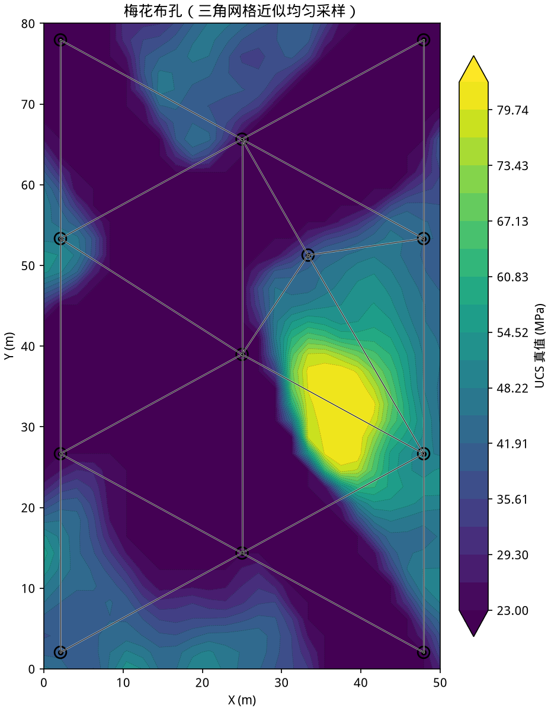

默认模型：\(X\in[0,50]\,\mathrm{m}\)，\(Y\in[0,80]\,\mathrm{m}\)，标高 \(0\to -40\,\mathrm{m}\)，约 10 个台阶。下文所有图与表均来自该模型、`seed=42`、12 口孔。

---

## 4. MWD 分支：孔点预测 + 三维克里金

### 4.1 Teale 比能与特征

原始通道：钻速 \(V\)、转速 \(N\)、扭矩 \(M\)、轴压 \(F\)。报告约定的比能（`mwd.features.specific_energy`）为

\[
\mathrm{SE}' \;=\; F + \frac{2\pi N M}{V}
\]

（分母加 \(10^{-9}\) 防止零钻速）。再拼无量纲比，得到 8 维特征

\[
\mathbf{x}=\bigl(V,\,N,\,M,\,F,\,\mathrm{SE}',\,M/F,\,V/N,\,V/F\bigr).
\]

\(\mathrm{SE}'\) 把“破碎岩石所做的功”收成一个与强度单调相关的物理量，后面的高斯过程用它做均值函数，而不是让核函数凭空学这个趋势。

### 4.2 物理引导高斯过程（PG-GPR）

纯数据 GPR 在样本外会漂。PG-GPR（`mwd.ucs_model.PhysicsGuidedGPR`）把比能线性趋势当作 GP **均值函数**，GP 只拟合残差：

\[
\mathrm{UCS}(\mathbf{x})
=\underbrace{\beta_0+\beta_1\,\mathrm{SE}'(\mathbf{x})}_{\text{物理基线 } m(\mathbf{x})}
+ f(\mathbf{x})+\varepsilon
\]

其中 \(f\sim\mathcal{GP}(0,k)\)，核为

\[
k(\mathbf{x},\mathbf{x}')
= \sigma_f^2 \exp\Bigl(-\frac{\|\mathbf{x}-\mathbf{x}'\|^2}{2\ell^2}\Bigr)
+ \sigma_n^2\,\delta_{\mathbf{x}\mathbf{x}'}.
\]

训练：先对 \(\mathrm{SE}'\) 做线性回归得 \(\hat\beta\)，再对残差 \(y_i-m(\mathbf{x}_i)\) 拟合 GP（特征经标准化）。预测

\[
\hat\mu_{\mathrm{hole}}(\mathbf{x})=m(\mathbf{x})+\mathbb{E}[f\mid \mathcal{D}](\mathbf{x}),
\qquad
\hat\sigma_{\mathrm{hole}}(\mathbf{x})=\sqrt{\mathrm{Var}[f\mid \mathcal{D}](\mathbf{x})}.
\]

样本稀疏时预测退回比能基线，而不是漂到无物理意义的值；\(\hat\sigma_{\mathrm{hole}}\) 进入下一步的融合方差。

### 4.3 回归克里金：从孔点到三维场

孔点预测仍是一维线。空间化采用**回归克里金**（`geostats.regression_kriging_3d`）：深度作为协变量，吸收台阶/埋深趋势，残差再做普通克里金。

记孔点位置 \(\mathbf{u}_i=(x_i,y_i,z_i)\)，观测 \(z_i=\hat\mu_{\mathrm{hole}}(\mathbf{x}_i)\)。趋势

\[
m_{\mathrm{RK}}(\mathbf{u})=\alpha_0+\alpha_1 z
\]

由孔点最小二乘估计。残差 \(r_i=z_i-m_{\mathrm{RK}}(\mathbf{u}_i)\) 用三维普通克里金插值。普通克里金是无偏线性估计

\[
\hat r(\mathbf{u}_0)=\sum_{i=1}^{n}\lambda_i r_i,
\qquad
\sum_{i=1}^{n}\lambda_i=1,
\]

权重由球状变异函数变差函数方程组给出。设 \(\gamma(h)\) 为变异函数，\(C(h)=C(0)-\gamma(h)\) 为协方差，则

\[
\begin{pmatrix}
C(\mathbf{u}_i-\mathbf{u}_j) & \mathbf{1} \\
\mathbf{1}^\top & 0
\end{pmatrix}
\begin{pmatrix}
\boldsymbol{\lambda} \\ \mu
\end{pmatrix}
=
\begin{pmatrix}
C(\mathbf{u}_i-\mathbf{u}_0) \\ 1
\end{pmatrix}
\]

克里金方差（残差场，代码忽略趋势系数的不确定度）

\[
\sigma^2_{\mathrm{OK}}(\mathbf{u}_0)
= C(0) - \boldsymbol{\lambda}^\top \mathbf{c}(\mathbf{u}_0) - \mu.
\]

最终 MWD 场与方差：

\[
S_M(\mathbf{u})=m_{\mathrm{RK}}(\mathbf{u})+\hat r(\mathbf{u}),
\qquad
\sigma_M^2(\mathbf{u})=\sigma^2_{\mathrm{OK}}(\mathbf{u})+\overline{\hat\sigma_{\mathrm{hole}}^2}.
\]

第二项把 PG-GPR 的点预测噪声均匀加到克里金方差上，避免把孔点 UCS 当成无误差真值。

单口铅垂孔没有横向滞后，三维变异函数无法从数据里估出来。此时实现回退到“以样本方差为基台、以模型对角线一半为变程”的球状模型：离孔后估计退回深度趋势，方差升高。这正是“只有一口井”时插值应有的行为。

### 4.4 为什么“只有钻孔”会不准

克里金是**最优线性**插值，不是错误的算法。它不准，是因为观测的几何不够：

- 12 口孔按梅花铺在 \(50\times 80\,\mathrm{m}\) 块段内部（离开自由面约半个孔距），相邻孔距约 14–18 m，胜任度场仍含有矿体/软弱带尺度的横向结构；
- 无横向样品时，残差克里金的最优解就是“回到均值”，于是一口井时 \(S_M\) 几乎是平面常数；孔变密后能勾出硬矿体轮廓，但孔间仍然过平滑；
- \(\sigma_M\) 在孔旁小、离孔大——这个方差后面会被融合用掉，而不是被丢掉。

下图同一色标：12 口梅花孔的克里金只在靶心附近有值，孔间几乎是深度趋势，硬矿体的亮斑基本丢了。

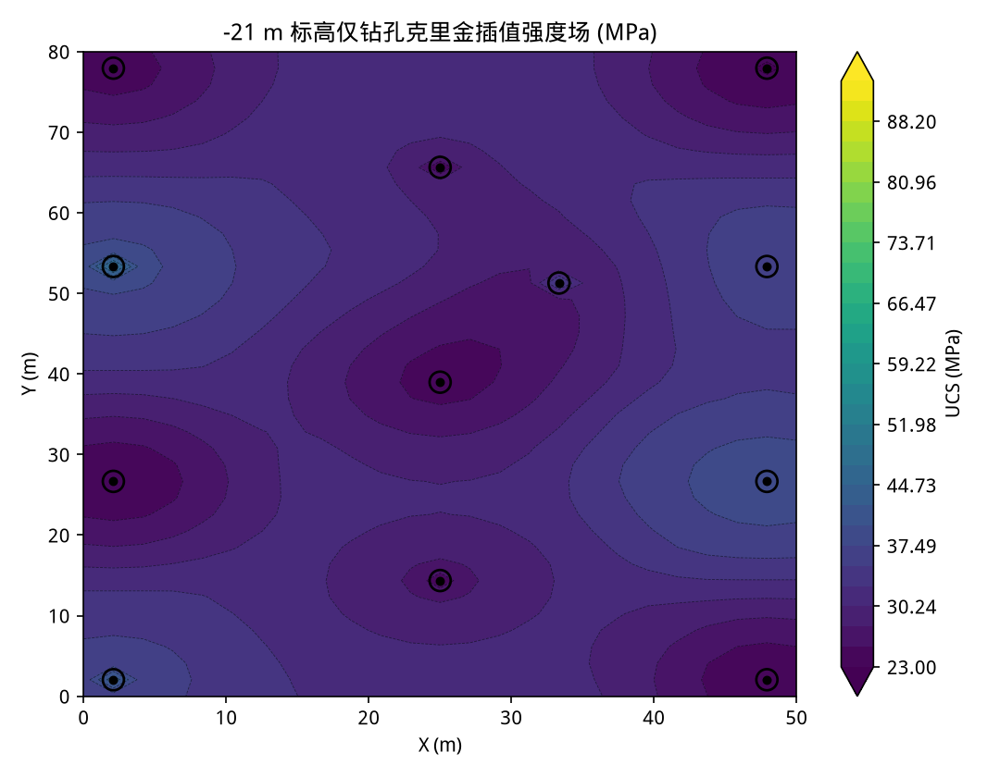

---

## 5. 地震分支：波阻抗反演 + \(\mathrm{AI}\to\mathrm{UCS}\) 标定

### 5.1 法向反射系数

声阻抗 \(Z=\rho V_p\)。层界面法向反射系数（`inversion.reflectivity`）

\[
R_i=\frac{Z_{i+1}-Z_i}{Z_{i+1}+Z_i}.
\]

反变换（给定井口阻抗 \(Z_0\)）

\[
Z_{i+1}=Z_i\frac{1+R_i}{1-R_i}.
\]

当相对扰动较小时 \(R_i\approx \tfrac12 \Delta \ln Z_i\)，从而反射系数对**对数阻抗**近似线性。反演因此在 \(m=\ln Z\) 域进行。

### 5.2 褶积正演

零相位 Ricker 子波（主频 \(f_0\)，采样 \(\Delta t\)）

\[
w(t)=\bigl(1-2(\pi f_0 t)^2\bigr)\,e^{-(\pi f_0 t)^2}.
\]

叠后道

\[
d = W r,
\qquad
r \approx \tfrac12 D m,
\qquad
m=\ln Z,
\]

其中 \(W\) 为 `same` 模式褶积矩阵，\(D\) 为一阶差分（末行补零以保持方阵）。复合正演算子

\[
G = W\bigl(\tfrac12 D\bigr)
\]

把对数阻抗直接映射到地震道（`inversion.forward.forward_operator`）。合成记录用**精确** \(R_i\) 再与 \(W\) 褶积，比线性化 \(G\) 多保留一点非线性，作为更忠实的正演。

### 5.3 模型基 Tikhonov 反演

地震是带限的：缺低频则绝对阻抗漂，缺高频则界面发糊。稳定化靠两件事：平滑低频背景 \(m_0=\ln Z_{\mathrm{bg}}\)（井/层位趋势的代理，这里用对数域高斯平滑），以及二阶差分光滑项。单道问题（`inversion.model_based`）

\[
\min_m \;
\|Gm-d\|_2^2
+\lambda\,\|L(m-m_0)\|_2^2
+\varepsilon\,\|m-m_0\|_2^2
\]

其中 \(L\) 为内点二阶差分（边界行填零）。这是严格凸二次型，法方程

\[
\bigl(G^\top G+\lambda L^\top L+\varepsilon I\bigr)(m-m_0)
= G^\top\bigl(d-G m_0\bigr).
\]

闭式解

\[
m = m_0 + \bigl(G^\top G+\lambda L^\top L+\varepsilon I\bigr)^{-1} G^\top (d-G m_0),
\qquad
Z=\exp(m).
\]

\(G\) 只依赖子波和道长，三维体可对所有道分解一次、批量左乘。默认 \(\lambda=5\)，\(\varepsilon=10^{-3}\)，子波 31 点、30 Hz，观测噪声为记录标准差的 5%。

本基准上反演阻抗相对真值 \(\mathrm{AI}\) 的 \(R^2=0.839\)。

低频背景在现场来自井曲线沿层位插值；合成实验里用真值的重平滑代替，模拟“我们有趋势、没有高频”这一现实约束。

### 5.4 高斯过程标定 \(\mathrm{UCS}=f(\mathrm{AI})\)

阻抗不是强度。只在**同时有 AI 与 UCS 的孔点**上学习非线性映射（`fusion.calibration.ImpedanceStrengthCalibrator`）：

\[
\mathrm{UCS}=g(\mathrm{AI})+\eta,
\qquad
g\sim\mathcal{GP}(0,k_{\mathrm{RBF}}+\text{White}).
\]

AI 先标准化。预测在整个 \(\mathrm{AI}_{\mathrm{inv}}\) 体上给出

\[
S_Z(\mathbf{u})=\hat g\bigl(\mathrm{AI}_{\mathrm{inv}}(\mathbf{u})\bigr),
\qquad
\sigma_Z(\mathbf{u})=\hat\sigma_g\bigl(\mathrm{AI}_{\mathrm{inv}}(\mathbf{u})\bigr).
\]

标定样本随钻孔增加而变多，所以地震分支的强度场也会随孔数**轻微**变好——不是因为阻抗体变了（钻孔数量实验里阻抗体固定），而是 \(g\) 估得更稳。一口井沿深度已有数十个 \((\mathrm{AI},\mathrm{UCS})\) 对，一维标定在 \(n=1\) 时就已经可用。

---

## 6. 共定位协克里金融合

井（准、稀）+ 地震（连续、不准）是储层建模的经典设定。Xu、Tran、Srivastava、Journel（SPE 24742）给出两种做法：**外漂移克里金**（KED：井为硬数据，地震为漂移）和**共定位协克里金**。Doyen、den Boer、Pillet（SPE 36498）把共定位协克里金写成对井克里金的贝叶斯更新：只需主变量克里金方差和井–地震相关系数，不必解完整的协克里金方程组，也不必估计空间交叉协方差。GSTools 的 `SimpleCollocated` / `ExtDrift` 是同一套方法的开源实现。

把已经插好的 \(S_M\) 和 \(S_Z\) 当成**独立**观测做逆方差混合，假设不成立——两路共用同一批标定井，\(S_Z\) 会把孔上真值往阻抗方向拉。本仓库以前用紧支撑核把硬数据钉回去，那是补丁；现在 \(S_F\) 按上述文献构造，孔上 \(\sigma_M\to 0\) 时更新系数自动为零。

### 6.1 Doyen 贝叶斯更新（两口井及以上）

记主变量克里金为 \(S_M(\mathbf{u})\)、\(\sigma_M^2(\mathbf{u})\)，共定位次变量为 \(S_Z(\mathbf{u})\)。相关系数用**物理次变量**估计，避免 GP 标定把 \(\rho\) 抬到 1：

\[
\rho
=\mathrm{corr}\bigl(\hat\mu_{\mathrm{hole}},\,\mathrm{AI}_{\mathrm{inv}}(\mathbf{u}_i)\bigr)
\quad\text{（孔点上）}.
\]

标准化（Deutsch / Doyen）

\[
y_k'=\frac{S_M-m_y}{\sigma_y},\qquad
y_s'=\frac{S_Z-m_z}{\sigma_z},\qquad
\sigma_k'^2=\mathrm{clip}\bigl(\sigma_M^2/\sigma_y^2,\,0,1\bigr),
\]

其中 \(m_y,\sigma_y\) 由孔点 UCS 估计，\(m_z,\sigma_z\) 由孔点 \(S_Z\) 估计。更新

\[
\lambda
=\frac{\rho\,\sigma_k'^2}{\rho^2\sigma_k'^2+1-\rho^2},\qquad
y_{\mathrm{cc}}'
= y_k'+\lambda\bigl(y_s'-\rho\,y_k'\bigr),
\]

\[
\sigma_{\mathrm{cc}}'^2
=\frac{\sigma_k'^2\,(1-\rho^2)}{\rho^2\sigma_k'^2+1-\rho^2}.
\]

回到原单位即 \(S_F\)、\(\sigma_F^2\)。主变量权重 \(w_M=1-\lambda\rho\)：

- 孔上 \(\sigma_M\to 0\)，\(\lambda\to 0\)，\(S_F\to S_M\)（硬数据）；
- 远处 \(\sigma_k'^2\to 1\)，\(S_F\to m_y+\rho\,\sigma_y(S_Z-m_z)/\sigma_z\)（地震线性回归），\(w_M\to 1-\rho^2\)。

实现：`fusion.uncertainty_fusion.doyen_collocated_update`。孔轨迹体素再写回 PG-GPR 点估计，防止变异函数块金把硬数据抹掉。

### 6.2 单口井：波阻抗外漂移克里金

一口井时 \(\mathrm{AI}\to\mathrm{UCS}\) 的 GP 会把该孔拟合到 \(\rho_{S_Z}\approx 1\)，Doyen 更新在远处退化成 \(S_Z\)，比纯插值还差。此时改用 Xu/Journel 的外漂移克里金：主变量仍是孔点 UCS，漂移为 \((\mathrm{depth},\,\mathrm{AI}_{\mathrm{inv}})\)，即现成的 `geostats.regression_kriging_3d`。远处是沿该孔估计的线性岩石物理关系，残差克里金只在孔旁注入力学残差，不会把过拟合的 GP 铺到全块段。

### 6.3 固定权重平均（对照）

\[
S_w = w S_M + (1-w) S_Z,
\qquad w=1/2.
\]

简单平均仍是有用的下限：它没有孔上硬数据约束，体积上接近“两张图对半”。协克里金在同样的 \(S_M,S_Z\) 上改进体积误差，并给出 \(\sigma_F\) 和 \(w_M\)。

逆方差混合 `precision_weighted_fusion` 留在代码里作独立源基线，不再作为 \(S_F\)。

### 6.4 融合如何“修正”稀疏插值

- 横向结构来自共定位的 \(S_Z\)（连续波阻抗标定）；
- 孔旁的力学细节来自 \(S_M\)（MWD 克里金），并且是硬数据而不是权重折中；
- \(\rho\) 控制远处地震能改多少主变量先验，而不是让两张相关的图互相抵消。

下图上一行同一 UCS 色标：真值、仅钻孔、仅波阻抗标定、融合。下一行是预测减去真值的差距热力图（红偏高、蓝偏低，三列共用色标）：仅钻孔几乎看不见硬矿体，残差在亮斑上很大；仅波阻抗轮廓对了但蚀变/峰值仍偏；融合残差最浅。

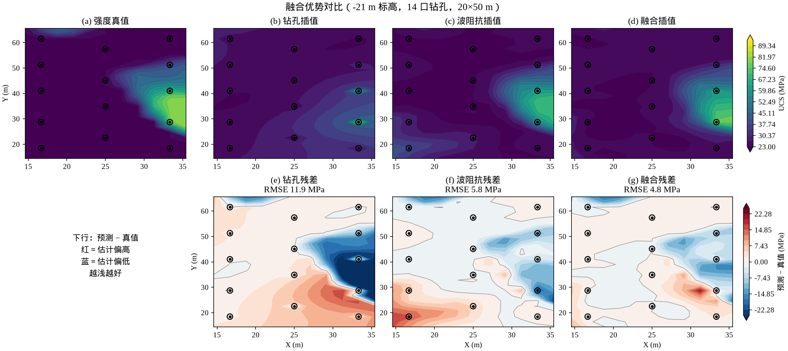

### 6.5 平面图上看着像全是波阻抗——钻孔是不是没用了？

不是。随机挤在一角时，大部分网格点离孔很远，\(S_F\) 接近地震回归，平面图会误导成“阻抗包办”。梅花均匀布孔之后，\(w_M\) 在每个靶心为 1，孔间回落到 \(1-\rho^2\)：结构仍来自波阻抗，幅值和孔旁力学残差被 MWD 拉开。钻孔另外还干一件阻抗自己做不了的事：

1. **把波阻抗翻译成强度。** \(S_Z=g(\mathrm{AI})\) 的 GP 只能在共定位孔点上训练。没有岩心/MWD 的 UCS，地震再连续也只是阻抗，不是爆破用的强度。
2. **在孔轨迹上钉住力学真值。** 蚀变、风化会改 UCS，却几乎不改 AI。沿孔剖面里，橙色“仅波阻抗”会偏离真值，绿色融合与 MWD 重合（硬数据不被抵消）。12 口孔轨迹上：仅波阻抗 RMSE \(=7.94\,\mathrm{MPa}\)，融合 \(=2.56\,\mathrm{MPa}\)（与仅钻孔相同）。

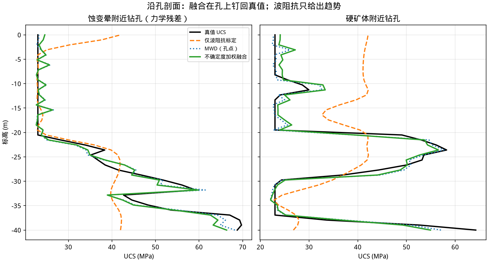

权重图把分工画出来：\(w_{\mathrm{MWD}}\) 在梅花靶心为 1，孔间回落到 \(1-\rho^2\)（本基准 \(\rho\approx 0.76\)，约 0.43），而不是被抹成 0。

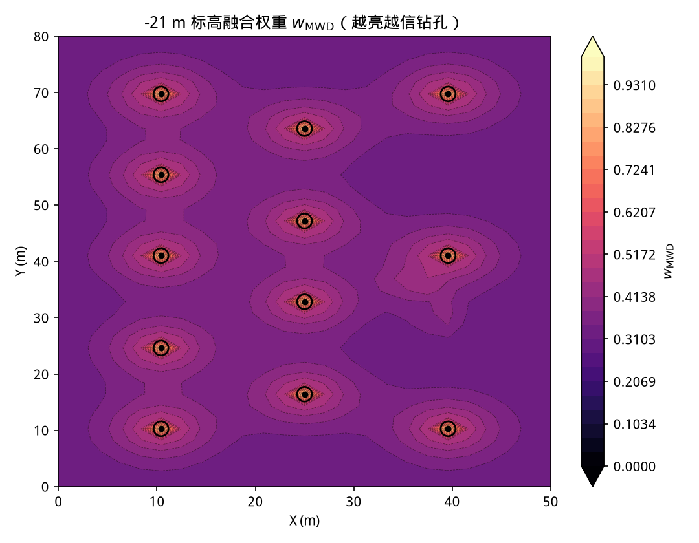

所以：钻孔**不是用来把全矿插值填满的**（那件事波阻抗更擅长），而是**标定器 + 硬数据**。梅花内缩布置让这些硬数据均匀盖住块段内部，插值本身也有用（仅钻孔 \(R^2=0.55\)），但体积误差仍高于融合，平面图上硬矿体峰值明显偏弱。

不确定度图把“开关”画出来：一口井时 MWD 的 \(\sigma_M\) 几乎全场都大，KED 融合的 \(\sigma_F\) 是残差克里金方差；12 口井时 Doyen 更新只在靶心附近把方差收到硬数据。

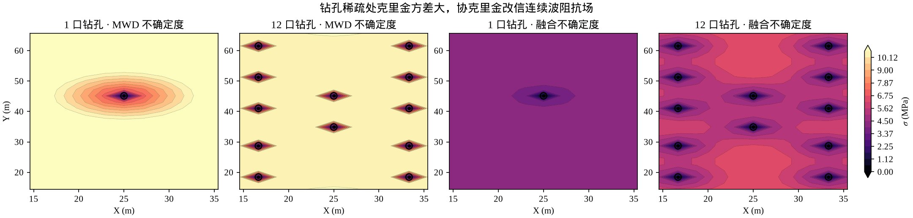

---

## 7. 钻孔数量实验：1 口 → 12 口

实验设计（`examples/run_docs_figures.py`）：

1. 生成 12 口孔的矿山，**只反演一次**波阻抗（地震覆盖与孔数无关）；
2. 取钻孔集合的嵌套前缀 \(\{1\}\subset\{1,2\}\subset\cdots\subset\{1,\ldots,12\}\)（`datasets.subset_holes`）；
3. 每个 \(n\) 重新做：PG-GPR → 回归克里金 → 用这 \(n\) 口孔标定 \(g(\mathrm{AI})\) → 协克里金融合（\(n=1\) 走波阻抗 KED，\(n\ge 2\) 走 Doyen 更新）；
4. 与同一份 \(\mathrm{UCS}_{\mathrm{true}}\) 比 \(R^2\)、RMSE；并单独统计距最近孔超过 \(0.4\times\) 中位孔距（本基准约 \(5.7\,\mathrm{m}\)）的远场 RMSE，以及孔轨迹上的 RMSE。

### 7.1 定性：插值随孔数变密，融合在标定可用后给出结构

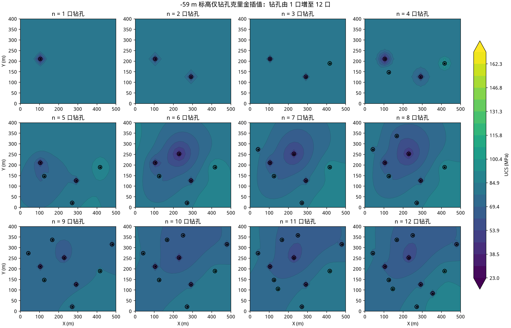

仅钻孔：\(n=1\) 几乎是平面常数；孔按最远点顺序增加后，梅花格子逐渐出现。到 \(n=12\) 仍比真值光滑，硬矿体峰值明显偏弱。

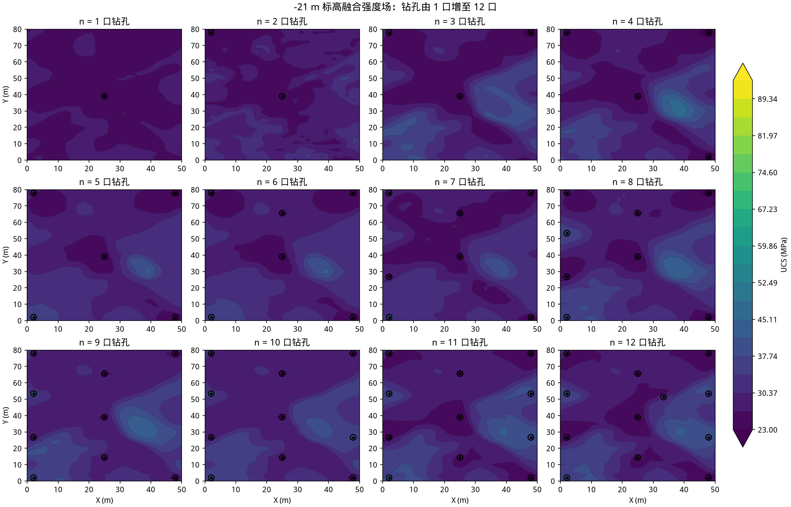

融合：\(n=2\) 起空间格局已接近 \(n=12\)（硬矿体、软弱带）。再增加钻孔主要是孔旁修订和标定微调。

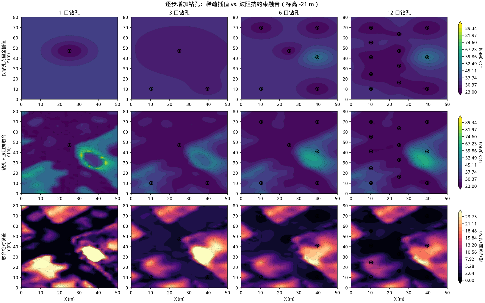

### 7.2 定量

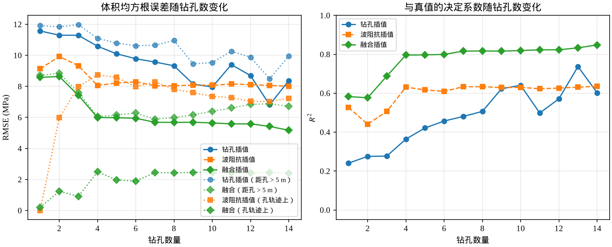

| 钻孔数 \(n\) | 仅钻孔 RMSE | 仅钻孔 \(R^2\) | 仅波阻抗 RMSE | 融合 RMSE | 融合 \(R^2\) | 孔上仅阻抗 | 孔上融合 |
| ---: | ---: | ---: | ---: | ---: | ---: | ---: | ---: |
| 1 | 11.82 | 0.303 | 12.77 | 10.00 | 0.502 | 0.01 | 0.23 |
| 2 | 11.79 | 0.308 | 9.32 | 7.89 | 0.690 | 8.20 | 0.07 |
| 4 | 11.53 | 0.338 | 8.98 | 7.88 | 0.691 | 8.23 | 1.58 |
| 6 | 10.93 | 0.405 | 8.94 | 7.61 | 0.711 | 7.63 | 2.81 |
| 8 | 10.64 | 0.436 | 8.93 | 7.45 | 0.723 | 7.76 | 2.73 |
| 12 | 9.49 | 0.552 | 9.01 | 7.01 | 0.755 | 7.94 | 2.56 |

（完整表见 [`images/well_count_metrics.csv`](images/well_count_metrics.csv)。远场阈值为 \(0.4\times\) 中位孔距。孔上融合 RMSE 与仅钻孔相同：硬数据被钉住。）

读表：

1. **一口井时融合走波阻抗 KED，不会把过拟合的 GP 铺到全块。** \(n=1\) 仅波阻抗 RMSE 12.8，比纯插值 11.8 还差；KED 融合 10.0，优于两路单独。
2. **两口井起 Doyen 更新，体积上融合优于两路单独。** \(n=12\) 时 RMSE 7.01，低于仅波阻抗 9.01 和仅钻孔 9.49。
3. **孔上融合 = MWD，远好于仅波阻抗。** 12 口孔轨迹上 2.56 vs 7.94；协克里金在 \(\sigma_M\to 0\) 时自动钉住硬数据。
4. **加孔主要改善插值和标定，结构仍来自阻抗。** 仅钻孔 \(R^2\) 从 0.30 升到 0.55；融合场的硬矿体轮廓在 \(n=2\)–\(4\) 已经出现。

所以：加钻孔**不会**让融合场从空白慢慢长出结构；结构来自波阻抗。加孔的价值是标定 \(g(\mathrm{AI})\)、钉住孔旁力学残差，梅花布置则让这些锚点均匀盖住块段。

---

## 8. 全孔基准（12 口）四种方案

同一真值体积上：

| 方案 | \(R^2\) | RMSE (MPa) | MAE (MPa) |
| --- | ---: | ---: | ---: |
| 仅 MWD 克里金插值 | 0.552 | 9.49 | 6.43 |
| 仅波阻抗标定 | 0.595 | 9.01 | 5.68 |
| 简单加权 \(w=1/2\) | 0.716 | 7.55 | 5.39 |
| **共定位协克里金（本方案）** | **0.755** | **7.01** | **4.95** |

补充：波阻抗反演本身 \(R^2(\mathrm{AI})=0.839\)。孔轨迹上融合 RMSE \(=2.56\)（与仅钻孔相同），仅波阻抗 \(=7.94\)。

- 相对**仅钻孔**，融合把体积 RMSE 从 9.49 降到 7.01，平面图上硬矿体从“看不见”变成有轮廓；
- 相对**仅波阻抗**，体积 RMSE 9.01 → 7.01，孔上真值不再被冲掉（见沿孔剖面与残差热力图）；
- 相对**简单平均**，体积 RMSE 7.55 → 7.01，并给出 \(\sigma_F\) 和 \(w_M\)，孔上由构造钉住钻孔。

单张切片真值、融合结果与阻抗场：

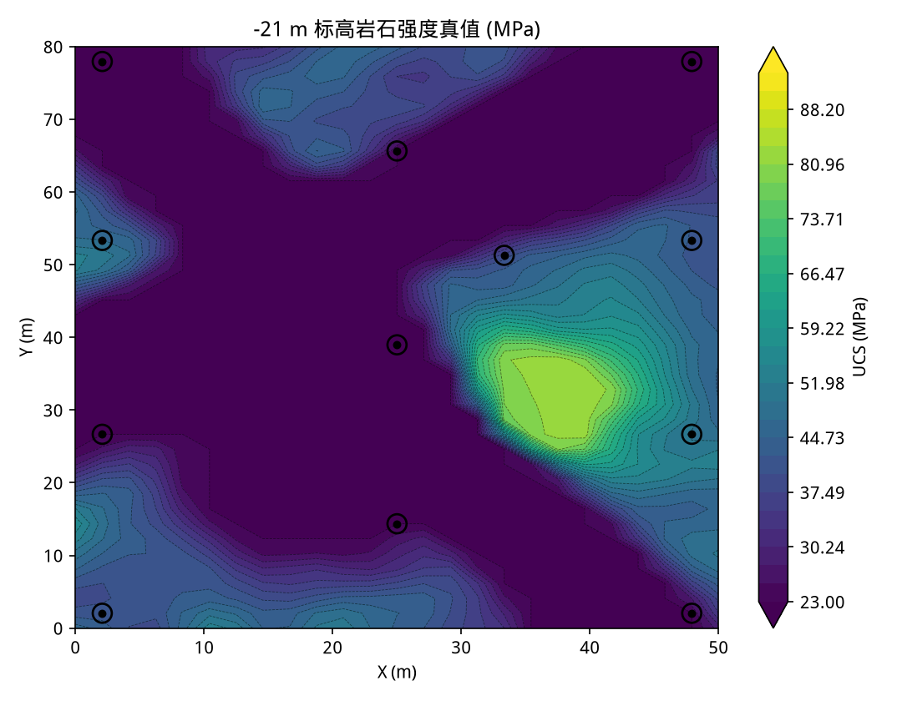

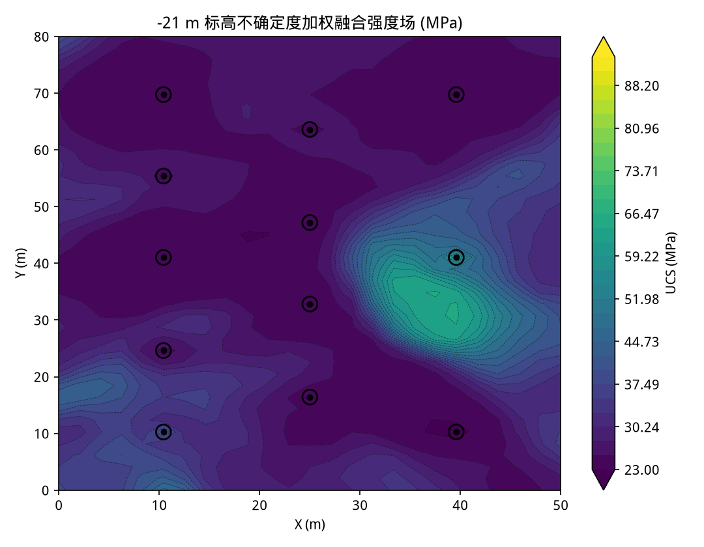

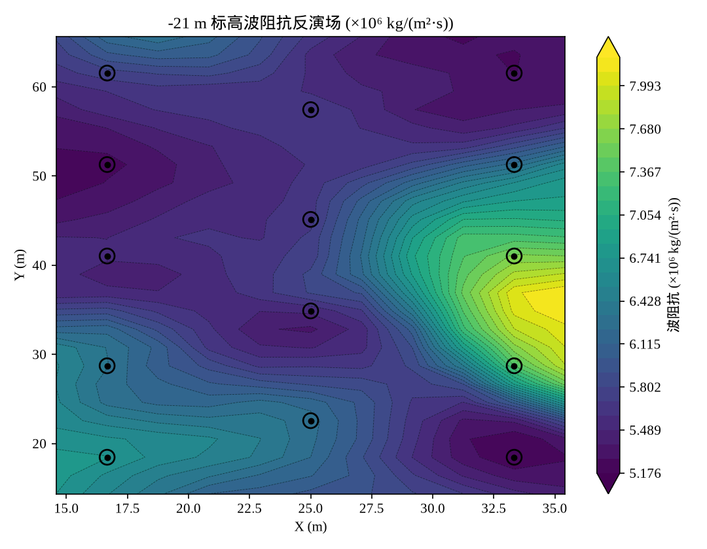

---

## 9. 误差定义

对全体素 \(\{t_i\}\)（真值）与 \(\{p_i\}\)（预测）：

\[
\mathrm{RMSE}=\sqrt{\frac1N\sum_i(t_i-p_i)^2},
\qquad
\mathrm{MAE}=\frac1N\sum_i|t_i-p_i|,
\]

\[
R^2=1-\frac{\sum_i(t_i-p_i)^2}{\sum_i(t_i-\bar t)^2}.
\]

实现：`validation.metrics`。

---

## 10. 可复现命令与模块对照

```bash
python3 -m pip install --user --break-system-packages -e ".[dev]"
python3 examples/run_fusion_benchmark.py --outdir results
python3 examples/run_docs_figures.py --outdir docs/images
python3 -m pytest
```

| 步骤 | 公式 | 代码 |
| --- | --- | --- |
| 合成真值 | 共享胜任度场 | `datasets.synthetic_mine.generate_mine` |
| 钻孔前缀 | 嵌套子集 | `datasets.subset_holes` |
| Teale 比能 | \(\mathrm{SE}'=F+2\pi NM/V\) | `mwd.features` |
| PG-GPR | 比能均值 + GP 残差 | `mwd.ucs_model.PhysicsGuidedGPR` |
| 回归克里金 | 深度趋势 + OK 残差 | `geostats.kriging` |
| 反射系数 / 正演 | \(R=(Z_{i+1}-Z_i)/(Z_{i+1}+Z_i)\)，\(d=Wr\) | `inversion.reflectivity`，`inversion.forward` |
| Tikhonov 反演 | \(m=m_0+(G^\top G+\lambda L^\top L+\varepsilon I)^{-1}G^\top(d-Gm_0)\) | `inversion.model_based` |
| \(\mathrm{AI}\to\mathrm{UCS}\) | GP 回归 | `fusion.calibration` |
| Doyen 共定位更新 | \(y_{\mathrm{cc}}'=y_k'+\lambda(y_s'-\rho y_k')\) | `fusion.uncertainty_fusion.doyen_collocated_update` |
| 单井外漂移克里金 | 漂移 \((\mathrm{depth},\mathrm{AI})\) | `geostats.regression_kriging_3d` |
| 独立源基线（不用作 \(S_F\)） | \(\mu_f=(\tau_M\mu_M+\tau_Z\mu_Z)/\tau_f\) | `fusion.uncertainty_fusion.precision_weighted_fusion` |
| 全流程 | 双分支 + 协克里金 | `fusion.pipeline.run_fusion_pipeline` |

中文图题需要 CJK 字体（`scripts/setup_fonts.sh` 或环境变量 `AI_INVERSION_CJK_FONT`）。指数与单位使用 mathtext（如 \(10^6\)、\(\mathrm{m}^2\)），避免 CJK 字体缺上标。
