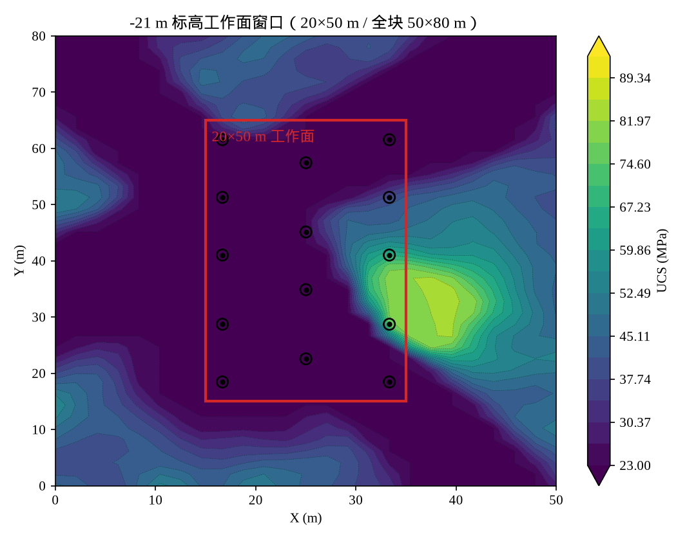
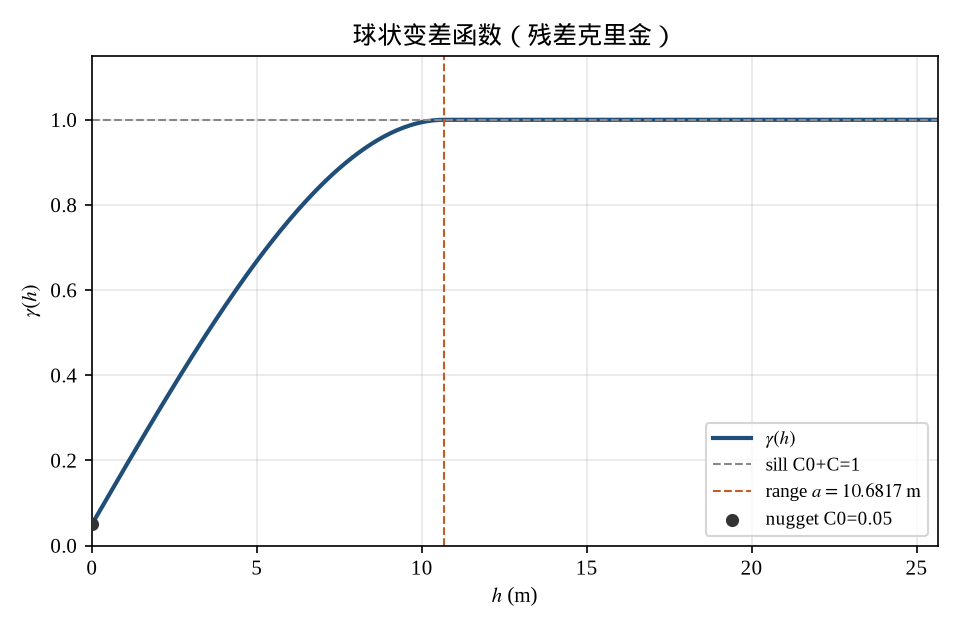
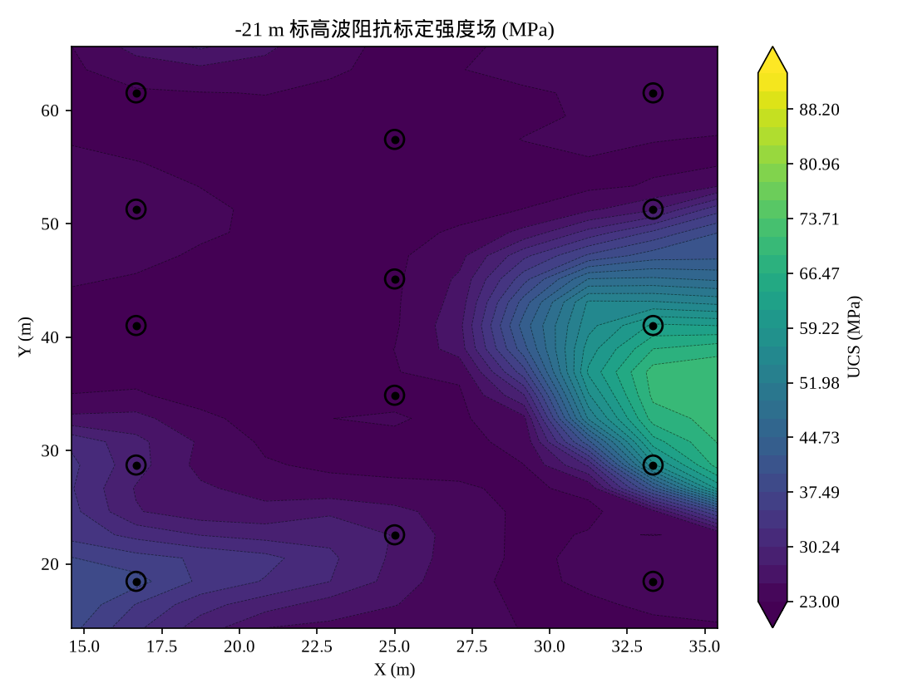
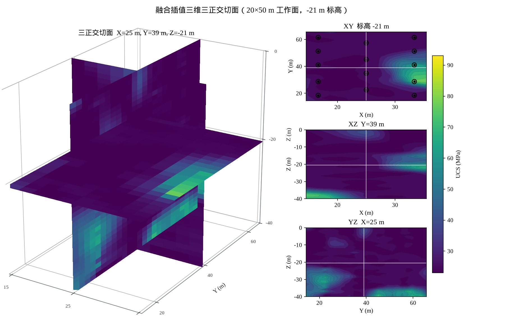

# 钻孔–波阻抗协同的三维岩石强度插值方法

**Method of interpolating three-dimensional rock strength from boreholes and acoustic impedance**

摘要：露天矿爆破块段需要连续的三维单轴抗压强度（UCS）场，而现场观测是两类不对等的数据：沿钻孔的力学硬数据，以及覆盖全块的叠后地震波阻抗。本文给出本系统实际采用的插值方案：以孔点 UCS 为主变量做三维普通克里金（钻孔插值），以 Tikhonov 反演波阻抗经孔点高斯过程标定得到全区次变量（波阻抗插值），再以深度与波阻抗强度为外漂移、孔距为残差变程的克里金完成融合插值。推导给出球状变差函数、普通克里金方程组、回归克里金 / 外漂移克里金（KED）以及单井时的 Doyen 共定位更新。全部图件由固定种子合成矿山（\(50\times 80\times 40\,\mathrm{m}\)，14 口梅花孔，默认工作面 \(20\times 50\,\mathrm{m}\)）再生，作为方法的定量证据。

关键词：普通克里金；外漂移克里金；球状变差函数；波阻抗标定；岩石强度；随钻测量

---

## 1. 引言

克里金（kriging）把空间估计写成观测的线性无偏组合，权由变差函数（variogram）决定，而不是由任意距离衰减核决定。这一思想源于矿山估值实践[^1]，由 Matheron 建成区域化变量理论[^2]，并在随后四十年成为矿业、石油与环境科学的标准工具[^3][^4][^5][^6]。当主变量（此处为 UCS）只在钻孔上可测、次变量（波阻抗）在全区连续时，单纯加密插值核并不能恢复孔间结构。储层建模对此有成熟答案：把地震当作**漂移**或**共定位协变量**，井当作硬数据[^7][^8]。

本仓库的三维强度场因此拆成三条可对照的插值路径，前端对比图与出版图使用同一组标题：

| 面板 | 含义 | 实现 |
| --- | --- | --- |
| 强度真值 | 合成矿山的 UCS 真值，只用于验证 | `datasets.generate_mine` |
| 钻孔插值 | 孔点 UCS 的三维回归克里金 | `S_M`，`geostats.regression_kriging_3d` |
| 波阻抗插值 | 全区 \(\mathrm{AI}\to\mathrm{UCS}\) 标定 | `S_Z`，`ImpedanceStrengthCalibrator` |
| 融合插值 | 外漂移克里金（单井走 Doyen） | `S_F`，`fusion.pipeline` |
| 钻孔残差 / 波阻抗残差 / 融合残差 | 预测 \(-\) 真值 | 同一切片、共用红蓝标 |

合成块段平面为 \(50\times 80\,\mathrm{m}\)、垂向 \(40\,\mathrm{m}\)（约十个台阶）。14 口梅花孔布置在中心 \(20\times 50\,\mathrm{m}\) 工作面内部（中列补了两个孔）；可视化默认只显示该区间，并可在全块上平移。图 1 给出梅花布孔与工作面窗口。




下文第 2 节给出变差函数与克里金方程，第 3–5 节对应三条插值路径，第 6 节给出融合残差与三正交切面证据。符号与代码一一对应。

---

## 2. 区域化变量与克里金

### 2.1 二阶平稳与变差函数

设区域化变量 \(Z(\mathbf{u})\) 在研究域 \(D\subset\mathbb{R}^3\) 上二阶平稳，或至少本征平稳（intrinsic）[^2][^3]。变差函数

\begin{equation}
\gamma(\mathbf{h})
=\frac12\,\mathrm{E}\bigl[Z(\mathbf{u}+\mathbf{h})-Z(\mathbf{u})\bigr]^2
\tag{1}
\end{equation}

度量相距 \(\mathbf{h}\) 的点对半方差。各向同性时 \(\gamma(\mathbf{h})=\gamma(\|\mathbf{h}\|)\)。本实现采用矿业中最常用的**球状模型**（spherical）[^3][^5]：

\begin{equation}
\gamma(h)=
\begin{cases}
0, & h=0,\\[4pt]
C_0 + C\Bigl(\dfrac{3h}{2a}-\dfrac{h^3}{2a^3}\Bigr), & 0<h\le a,\\[8pt]
C_0+C, & h>a.
\end{cases}
\tag{2}
\end{equation}

其中 \(C_0\) 为块金（nugget，测量误差与微结构），\(C_0+C\) 为基台（sill，先验方差），\(a\) 为变程（range，相关距离）。图 2 画出本基准残差克里金所用的球状模型：变程取 \(1.15\times\) 中位孔距（约 \(16.5\,\mathrm{m}\)），块金为基台的 \(5\%\)。



垂向采样远密于平面，PyKrige 的 `anisotropy_scaling_z=3` 把 \(z\) 轴按 3 倍拉伸后再算欧氏距离，等价于把（2）写成几何各向异性

\begin{equation}
h
=\sqrt{
\Bigl(\frac{h_x}{a_x}\Bigr)^2
+\Bigl(\frac{h_y}{a_y}\Bigr)^2
+\Bigl(\frac{h_z}{a_z}\Bigr)^2
},\qquad a_z = 3\,a_x.
\tag{3}
\end{equation}

### 2.2 普通克里金

普通克里金（ordinary kriging, OK）估计未知点 \(\mathbf{u}_0\) 的无偏线性组合[^3][^4]

\begin{equation}
\hat Z(\mathbf{u}_0)
=\sum_{i=1}^{n}\lambda_i Z(\mathbf{u}_i),
\qquad
\sum_{i=1}^{n}\lambda_i=1.
\tag{4}
\end{equation}

权 \(\boldsymbol{\lambda}\) 由克里金方程组给出。用变差函数写出（与协方差形式等价，本征平稳下更自然）[^5]：

\begin{equation}
\begin{pmatrix}
\Gamma & \mathbf{1}\\
\mathbf{1}^{\!\top} & 0
\end{pmatrix}
\begin{pmatrix}
\boldsymbol{\lambda}\\ \mu
\end{pmatrix}
=
\begin{pmatrix}
\boldsymbol{\gamma}_0\\ 1
\end{pmatrix},
\qquad
\Gamma_{ij}=\gamma(\mathbf{u}_i-\mathbf{u}_j),
\quad
(\boldsymbol{\gamma}_0)_i=\gamma(\mathbf{u}_i-\mathbf{u}_0).
\tag{5}
\end{equation}

拉格朗日乘子 \(\mu\) 强制无偏。克里金方差

\begin{equation}
\sigma_{\mathrm{OK}}^2(\mathbf{u}_0)
=\boldsymbol{\lambda}^{\!\top}\boldsymbol{\gamma}_0+\mu
\tag{6}
\end{equation}

在样品处为块金量级、在样品间随变程增大——这正是“钻孔插值在孔旁准、孔间光滑”的数学来源。实现：`geostats.ordinary_kriging_3d`（PyKrige `OrdinaryKriging3D`，网格排列从 \((n_z,n_y,n_x)\) 转回本项目的 \((n_x,n_y,n_z)\)）。

单孔时三维滞后无法识别，自动拟合失败则退化为：基台 \(=\mathrm{Var}\{Z_i\}\)，变程 \(=\) 域对角线之半。此时远离钻孔的估计回到样本均值，这是稀疏井的正确极限，而不是实现缺陷。

### 2.3 回归克里金与外漂移

当均值不是常数，而是已知协变量的线性函数时，普通克里金应换成回归克里金（regression kriging）或外漂移克里金（kriging with an external drift, KED）[^6][^9][^10]。二者在线性漂移下等价：先在样品上拟合

\begin{equation}
m(\mathbf{u})
=\alpha_0+\sum_{p=1}^{P}\alpha_p\,f_p(\mathbf{u}),
\tag{7}
\end{equation}

对残差 \(r_i=Z(\mathbf{u}_i)-m(\mathbf{u}_i)\) 做普通克里金，再把漂移加回网格

\begin{equation}
\hat Z_{\mathrm{RK}}(\mathbf{u})
=m(\mathbf{u})+\hat r_{\mathrm{OK}}(\mathbf{u}).
\tag{8}
\end{equation}

KED 把（7）直接写进克里金方程组（漂移基函数的权约束），数值上与（8）一致。本仓库用 sklearn 线性回归 \(+\) 三维 OK 实现（`geostats.regression_kriging_3d`），并允许把残差变程钉在孔距上：自动拟合在 \(50\times 80\,\mathrm{m}\) 的小块上会把变程拉到域对角线，把地震看不见的力学残差抹平。

---

## 3. 钻孔插值

钻孔路径先把随钻通道变成孔点 UCS，再把这些硬数据插到三维。

### 3.1 孔点：Teale 比能引导的高斯过程

原始通道为钻速 \(V\)、转速 \(N\)、扭矩 \(M\)、轴压 \(F\)。Teale 比能把破碎功收成与强度单调的物理量[^11]

\begin{equation}
\mathrm{SE}'
=F+\frac{2\pi NM}{V}.
\tag{9}
\end{equation}

物理引导高斯过程（PG-GPR）以 \(\mathrm{SE}'\) 为均值函数，RBF 核只拟合残差，得到孔点估计 \(\hat\mu_{\mathrm{hole}}(\mathbf{u}_i)\) 与方差。这不是空间插值，只是把四通道压缩成带不确定度的 UCS。

### 3.2 空间：以深度为趋势的回归克里金

岩石强度随深度有缓慢趋势。钻孔插值因此取协变量 \(f_1=z\)，

\begin{equation}
S_M(\mathbf{u})
=\alpha_0+\alpha_1 z
+\hat r_{\mathrm{OK}}(\mathbf{u}),
\tag{10}
\end{equation}

样品值为 \(\hat\mu_{\mathrm{hole}}\)。随后把孔体素**写回**点估计，避免块金把硬数据涂脏。图 3 是 \(-20\,\mathrm{m}\) 标高的钻孔插值：梅花格子清晰，硬矿体峰值被变程光滑掉——这是（2）（6）的直接后果，不是配色问题。


沿孔剖面里，钻孔插值与真值几乎重合（硬数据），这不能推广到孔间：工作面体积 RMSE 仍为 \(8.37\,\mathrm{MPa}\)，\(R^2=0.60\)（14 口孔，\(20\times 50\,\mathrm{m}\)）。

---

## 4. 波阻抗插值

地震覆盖全块，但测到的是声学量。波阻抗插值分两步：先反演 \(\mathrm{AI}=\rho V_p\)，再在共定位孔点上学习 \(\mathrm{UCS}=g(\mathrm{AI})\)。

### 4.1 卷积模型与 Tikhonov 反演

叠后道写成对数阻抗增量与子波的卷积。Tikhonov 正则把反演写成严格凸二次型，法方程

\begin{equation}
\bigl(G^{\top}G+\lambda L^{\top}L+\varepsilon I\bigr)(m-m_0)
=G^{\top}(d-Gm_0),
\tag{11}
\end{equation}

闭式解 \(Z=\exp(m)\)。低频背景来自重平滑趋势（现场则来自井曲线沿层位插值）。本基准 \(\mathrm{AI}\) 反演相对真值 \(R^2=0.844\)。

### 4.2 孔点标定后的全区映射

阻抗不是强度。只在同时有 AI 与 UCS 的孔点上拟合高斯过程[^4]

\begin{equation}
\mathrm{UCS}=g(\mathrm{AI})+\eta,
\qquad
g\sim\mathcal{GP}(0,k_{\mathrm{RBF}}+\text{White}),
\tag{12}
\end{equation}

再把 \(\hat g\) 作用到整张 \(\mathrm{AI}_{\mathrm{inv}}\)，得到 \(S_Z(\mathbf{u})\)。这是**标定后的插值**：空间结构来自地震，力学标尺来自井。图 4 显示硬矿体轮廓已经出现，但蚀变晕（力学残差、波阻抗看不见）被系统性估高。



体积 RMSE \(8.02\,\mathrm{MPa}\)，略优于钻孔插值；孔轨迹上 RMSE \(7.23\,\mathrm{MPa}\)，明显差于硬数据。把 \(S_Z\) 当作另一张可以和 \(S_M\) 对半平均的强度图，会在孔上冲掉真值。

---

## 5. 融合插值

井稀而准、地震密而不准，是 Journel 学派的经典设定。Xu 等给出两条路：外漂移克里金，以及共定位协克里金[^7]。Doyen 等把后者写成对井克里金的贝叶斯更新[^8]。本系统**两口井及以上走 KED，单口井走 Doyen**，孔体素一律钉回 \(\hat\mu_{\mathrm{hole}}\)。

### 5.1 两口井及以上：外漂移克里金

主变量为孔点 UCS，漂移基为深度与波阻抗强度

\begin{equation}
m_{\mathrm{KED}}(\mathbf{u})
=\alpha_0+\alpha_1 z+\alpha_2 S_Z(\mathbf{u}).
\tag{13}
\end{equation}

\(\boldsymbol{\alpha}\) 由孔点最小二乘估计。残差

\begin{equation}
r_i
=\hat\mu_{\mathrm{hole}}(\mathbf{u}_i)-m_{\mathrm{KED}}(\mathbf{u}_i)
\tag{14}
\end{equation}

做三维普通克里金，球状变程 \(a=1.15\times\) 中位孔距（下限 \(8\,\mathrm{m}\)），垂向各向异性系数 3。于是

\begin{equation}
S_F(\mathbf{u})
=m_{\mathrm{KED}}(\mathbf{u})+\hat r_{\mathrm{OK}}(\mathbf{u}).
\tag{15}
\end{equation}

三点性质直接来自方程，而不是调参：

1. 孔上 \(\hat r=0\) 且体素写回，硬数据不被冲掉；
2. 孔旁一个变程内，\(\hat r\) 带上蚀变 / 风化等 AI 看不见的力学残差；
3. 离孔后 \(\hat r\to 0\)，\(S_F\to m_{\mathrm{KED}}\)，结构与峰值来自 \(S_Z\)，**不会**被共定位相关系数 \(\rho\) 打到 \(3/4\) 峰值。

Doyen 更新在远处按 \(\rho\) 收缩次变量异常。本基准 \(\rho\approx 0.76\)，硬矿体在 \(S_Z\) 上的峰值若走 Doyen 会被压矮；KED 没有这一项。

### 5.2 单口井：Doyen 共定位更新

一口井时 \(\mathrm{AI}\to\mathrm{UCS}\) 的 GP 会把该孔拟合到近乎 \(\rho_{S_Z}\approx 1\)，KED 的 \(S_Z\) 漂移会把过拟合铺满全块。此时改用 Doyen 标准化更新[^8]

\begin{equation}
\lambda
=\frac{\rho\,\sigma_k'^2}{\rho^2\sigma_k'^2+1-\rho^2},
\qquad
y_{\mathrm{cc}}'
=y_k'+\lambda\bigl(y_s'-\rho\,y_k'\bigr),
\tag{16}
\end{equation}

其中 \(y_k'\) 为钻孔克里金标准化值，\(y_s'\) 为次变量标准化值，\(\rho=\mathrm{corr}(\mathrm{UCS},\mathrm{AI})\)。\(\rho\) 限制更新幅度，单井不会把一个孔的 GP 标定当成全区真理。

### 5.3 与逆方差混合的区别

把已经插好的 \(S_M\) 与 \(S_Z\) 当成独立观测做

\begin{equation}
S
=\frac{\tau_M S_M+\tau_Z S_Z}{\tau_M+\tau_Z},
\qquad
\tau=1/\sigma^2
\tag{17}
\end{equation}

假设不成立：两路共用同一批标定井。简单平均的工作面体积 RMSE 为 \(7.14\,\mathrm{MPa}\)，KED 为 \(5.17\,\mathrm{MPa}\)。融合插值不是“两张图的加权”，而是“地震为漂移、井为硬数据”的一次克里金。


---

## 6. 证据：残差、沿孔剖面与三正交切面

图 6 是与前端出图同一套 2×4 布局。上一行共用 UCS 色标：强度真值、钻孔插值、波阻抗插值、融合插值。下一行是残差（预测 \(-\) 真值）：钻孔残差、波阻抗残差、融合残差，红＝估高、蓝＝估低，三列共用色标，越浅越好。


定量（\(20\times 50\,\mathrm{m}\) 工作面、14 口孔、`seed=42`）：

| 方法 | \(R^2\) | RMSE (MPa) | MAE (MPa) |
| --- | --- | --- | --- |
| 钻孔插值 | 0.602 | 8.37 | 5.13 |
| 波阻抗插值 | 0.636 | 8.02 | 4.55 |
| 简单平均 | 0.711 | 7.14 | 4.55 |
| 融合插值 | 0.848 | 5.17 | 3.20 |

孔轨迹上融合 RMSE \(=2.41\,\mathrm{MPa}\)（与钻孔插值相同），波阻抗插值 \(=7.23\,\mathrm{MPa}\)：硬数据被钉住。图 7 沿蚀变晕附近钻孔与硬矿体附近钻孔画出四条曲线，波阻抗插值偏离真值，融合插值与钻孔插值重合。


图 8 把当前工作面画成三维三正交切面（XY / XZ / YZ），白底对应 AutoCAD / SolidWorks / matplotlib 亮色风格，便于截图。前端“三维三切面”出图与此同一套配方。



随钻孔数从 1 增至 14（图 9）：一口井时融合走 Doyen，不会把过拟合的 GP 铺满全块；两口井起 KED，体积误差低于两路单独。加孔主要改善钻孔插值与标定，硬矿体轮廓在 \(n=2\)–\(4\) 已由波阻抗给出。


---

## 7. 工作面截取

克里金代价随孔点数与网格体积上升。合成全块保持 \(50\times 80\times 40\,\mathrm{m}\)、网格 \(25\times 40\times 40\)，14 口梅花孔铺在中心 \(20\times 50\,\mathrm{m}\) 工作面内。前端与出版图默认只显示该工作面，并提供 \(X\)、\(Y\) 原点滑条在全块上平移窗口。这是可视化截取，不是重新插值：三维场仍在全块上一次算完。

---

## 8. 结论

1. **钻孔插值**是带深度趋势的三维普通克里金。它在孔上精确，但不能凭空恢复孔间的矿体与断裂；球状变程把这一限度写进方程（2）（6）。
2. **波阻抗插值**是全区 AI 经孔点 GP 标定。它供给结构，但不供给 AI 看不见的力学残差。
3. **融合插值**把 \(S_Z\) 当作外漂移、孔点 UCS 当作硬数据。残差变程取孔距，峰值不被 \(\rho\) 打折；单井才使用 Doyen 更新以免过拟合扩散。
4. 出版图与前端出图共用同一组中文面板名与残差名；拉丁字母、数字与数学用 Times / Liberation Serif，汉字走 CJK 回退。三维三切面按亮色白底绘制，便于截图。

实现入口：`fusion.pipeline.run_fusion_pipeline`。再生本文全部图件：

```bash
python3 examples/run_docs_figures.py --outdir docs/images
```

---

## 参考文献

[^1]: Krige, D. G. A statistical approach to some basic mine valuation problems on the Witwatersrand. *Journal of the Chemical, Metallurgical and Mining Society of South Africa* **52**, 119–139 (1951).

[^2]: Matheron, G. Principles of geostatistics. *Economic Geology* **58**, 1246–1266 (1963).

[^3]: Journel, A. G. & Huijbregts, C. J. *Mining Geostatistics*. Academic Press (1978).

[^4]: Cressie, N. *Statistics for Spatial Data*. Wiley (1993).

[^5]: Deutsch, C. V. & Journel, A. G. *GSLIB: Geostatistical Software Library and User’s Guide* 2nd edn. Oxford University Press (1998).

[^6]: Goovaerts, P. *Geostatistics for Natural Resources Evaluation*. Oxford University Press (1997).

[^7]: Xu, W., Tran, T. T., Srivastava, R. M. & Journel, A. G. Integrating seismic data in reservoir modeling: the collocated cokriging alternative. *SPE Annual Technical Conference and Exhibition*, SPE-24742-MS (1992).

[^8]: Doyen, P. M., den Boer, L. D. & Pillet, W. W. Seismic porosity mapping in the Ekofisk field using a new form of collocated cokriging. *SPE Annual Technical Conference and Exhibition*, SPE-36498-MS (1996).

[^9]: Odeh, I. O. A., McBratney, A. B. & Chittleborough, D. J. Further results on prediction of soil properties from terrain attributes: heterotopic cokriging and regression-kriging. *Geoderma* **67**, 215–226 (1995).

[^10]: Hengl, T., Heuvelink, G. B. M. & Rossiter, D. G. About regression-kriging: from equations to case studies. *Computers & Geosciences* **33**, 1301–1315 (2007).

[^11]: Teale, R. The concept of specific energy in rock drilling. *International Journal of Rock Mechanics and Mining Sciences* **2**, 57–73 (1965).

[^12]: Wackernagel, H. *Multivariate Geostatistics* 3rd edn. Springer (2003).

[^13]: Chilès, J.-P. & Delfiner, P. *Geostatistics: Modeling Spatial Uncertainty* 2nd edn. Wiley (2012).

[^14]: Delhomme, J. P. Kriging in the hydrosciences. *Advances in Water Resources* **1**, 251–266 (1978).
